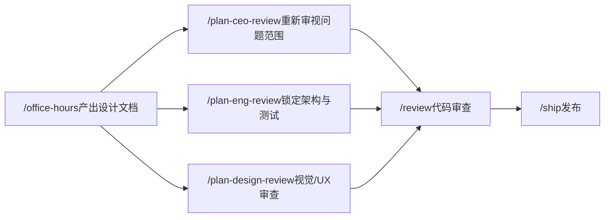

# `/office-hours`

> **一句话定位：** YC 创业答疑室。在你动手写代码之前，帮你把问题想清楚，最终产出一份设计文档。

---

## **概述**

`/office-hours` 是 gstack 中最应该第一个运行的技能。它模拟了 Y Combinator 合伙人的答疑风格，通过一系列强迫性的问题，帮你在动手之前厘清真正的问题是什么、谁真正需要这个产品、最小可行的切入点在哪里。

**它不写代码。** 它只产出一份设计文档（Design Doc），这份文档会自动被后续的 `/plan-ceo-review`、`/plan-eng-review`、`/qa` 等技能读取和引用。

**触发时机：**

- 你说"我有个想法"、"帮我想想这个"、"这值得做吗"
- 你在描述一个还没有任何代码的新产品方向
- 你准备开始一个新功能，但还没有想清楚

**使用顺序：** `/office-hours` → `/plan-ceo-review` → `/plan-eng-review` → 开始实现

---

## **两种工作模式**

运行 `/office-hours` 后，它首先会问你一个问题：**你做这个的目标是什么？**

根据你的回答，它会进入两种完全不同的工作模式。

### **创业模式（Startup Mode）**

适用场景：你在做创业项目，或者在公司内部推进一个需要快速落地的项目（内部创业）。

这个模式会把你当作创始人来对待——直接、不留情面、追问到底。它的任务是诊断，不是鼓励。

### **构建者模式（Builder Mode）**

适用场景：你在做黑客马拉松、开源项目、学习项目、副业，或者就是想玩玩。

这个模式会变成你的热情合作者——帮你找到想法中最酷的那个版本，激发灵感，而不是质疑你。

---

## **完整工作流程**

`/office-hours` 按照以下六个阶段依次推进，每个阶段都有明确的目标和输出。

### **第一阶段：上下文收集（Context Gathering）**

在提问之前，技能会先自己做功课：

- 读取项目中的 `CLAUDE.md` 和 `TODOS.md`（如果存在）
- 运行 `git log --oneline -30` 了解最近的代码提交历史
- 扫描与你请求最相关的代码区域
- 列出该项目已有的历史设计文档，避免重复劳动
- 搜索过去会话中积累的"学习记录"，如果发现与当前问题相关的历史经验，会主动应用并告知你

然后它会问你一个关键问题：**你做这个的目标是什么？** 并据此判断进入哪种模式，以及你的产品处于哪个阶段（无用户/有用户/有付费用户）。

---

### **第二阶段 A：创业模式——六个强迫性问题**

这六个问题是创业模式的核心。它们不是友好的聊天，而是一套诊断工具。每个问题**单独提问**，等你回答后才问下一个。

根据你的产品阶段，不一定六个都问：

- 还没有产品 → 问 Q1、Q2、Q3
- 已有用户 → 问 Q2、Q4、Q5
- 已有付费用户 → 问 Q4、Q5、Q6

#### **Q1：需求真实性**

> "你有什么最有力的证据，证明真的有人需要这个——不是'感兴趣'，不是'加了等待列表'，而是如果明天它消失了，他们会真正感到崩溃？"

**推问到你说出：** 具体行为、有人付钱、有人把工作流程建立在你的产品上、有人在你宕机时打电话来。

**红旗信号：** "大家说很有趣"、"我们有500个等待列表注册"、"投资人对这个赛道很兴奋"——这些都不是需求。

#### **Q2：现状替代方案**

> "你的用户现在是怎么解决这个问题的——哪怕解决得很糟糕？这个替代方案让他们付出了多大代价？"

**推问到你说出：** 具体的工作流程、花费的小时数、浪费的钱、拼凑在一起的工具组合、雇人手动完成的任务。

**红旗信号：** "没有解决方案，这就是机会所在。" 如果真的什么都没有，通常说明问题还不够痛。

#### **Q3：极致具体的目标用户**

> "说出最需要这个产品的那个真实的人。他们的职位是什么？什么让他们升职？什么让他们被炒鱿鱼？什么让他们夜不能寐？"

**推问到你说出：** 一个名字、一个角色、如果问题没有解决他们会面临的具体后果。

**红旗信号：** "医疗行业的企业"、"中小企业"、"营销团队"——这些是过滤条件，不是人。你无法给一个类别发邮件。

#### **Q4：最窄切入点**

> "这个产品最小可行的版本是什么——某人这周就愿意为之付真实金钱的版本，不是等你把平台建好之后？"

**推问到你说出：** 一个功能、一个工作流。也许只是一封周报邮件或一个自动化操作。创始人应该能描述出一个几天内就能发布、有人愿意付钱的东西。

**额外追问：** "如果用户什么都不需要做就能获得价值——不用登录、不用集成、不用设置——会是什么样子？"

#### **Q5：观察与意外**

> "你有没有真正坐下来，看着某人在没有你帮助的情况下使用这个产品？他们做了什么让你感到意外的事？"

**推问到你说出：** 一个具体的意外。某件用户做的事情与你的假设相矛盾的事。

**最有价值的发现：** 用户用产品做了它根本没有设计用来做的事——这往往就是真正的产品在试图浮现。

#### **Q6：未来适配性**

> "如果三年后世界发生了有意义的变化——它必然会——你的产品会变得更不可或缺，还是更不重要？"

**推问到你说出：** 关于用户的世界将如何变化、以及为何这种变化会让你的产品更有价值的具体主张。

**红旗信号：** "市场每年增长20%"——增长率不是愿景。"AI会让一切变得更好"——这不是产品论点。

---

#### **创业模式的核心原则**

这些原则贯穿整个创业模式，不可妥协：

**具体性是唯一货币。** 模糊的回答会被追问。"医疗行业的企业"不是客户，你需要一个名字、一个角色、一个公司、一个原因。

**兴趣不等于需求。** 等待列表、注册、"很有趣"——都不算数。行为算数，金钱算数，宕机时打来的电话算数。

**用户的话胜过创始人的推销。** 创始人说产品做什么和用户说产品做什么之间，几乎总有差距。用户的版本才是真相。

**观察，不要演示。** 引导式演示对真实使用情况毫无价值。坐在某人后面看他们挣扎——并咬住舌头——才能告诉你一切。

**现状才是你真正的竞争对手。** 不是另一家创业公司，不是大公司——而是你的用户已经在使用的那个拼凑起来的电子表格加Slack消息的解决方案。

---

### **第二阶段 B：构建者模式——设计伙伴**

构建者模式完全不同。这里没有审讯，只有协作。

五个生成性问题（同样逐一提问）：

- **最酷的版本是什么？** 什么会让人说"哇"？
- **你会把这个展示给谁？** 什么会让他们说"哇"？
- **最快能做出可以实际使用或分享的东西的路径是什么？**
- **现有的最接近这个的东西是什么？你的有何不同？**
- **如果时间无限，你会加什么？** 10倍版本是什么？

构建者模式的核心信念：

- 令人愉悦才是货币——什么让人说"哇"？
- 发布一个你能展示给别人的东西。存在的版本才是最好的版本。
- 最好的副业项目解决你自己的问题。
- 先探索，再优化。先尝试那个奇怪的想法，后面再打磨。

**模式切换：** 如果你在构建者模式中途说"其实我觉得这可以是一家真正的公司"，技能会自然地升级到创业模式，问你更难的问题。

---

### **第二阶段 2.5：相关设计发现**

在你说出问题之后，技能会自动搜索该项目历史上的设计文档，看看是否有关键词重叠。如果找到相关设计，会告诉你："发现了一份相关设计——'{标题}'，由{用户}在{日期}创建（分支：{分支}）。关键重叠：{一行摘要}。要基于这份旧设计继续，还是重新开始？"

这个功能在团队协作中特别有用——多个用户探索同一项目时，可以看到彼此的设计文档。

---

### **第二阶段 2.75：市场格局感知**

在通过提问理解了问题之后，技能会搜索外部信息，了解世界对这个领域的普遍认知。

**注意：** 这不是竞品调研（那是 `/design-consultation` 的工作），而是理解主流认知，以便评估它在哪里是错的。

搜索前会先问你是否同意发送（只发送通用类别词，不发送你的具体想法或产品名）。

搜索完成后，技能会进行三层综合分析：

- **第一层：** 这个领域里人人都知道的事
- **第二层：** 搜索结果和当前讨论在说什么
- **第三层：** 结合我们在第二阶段学到的——主流方法在哪里是错的？

如果第三层分析揭示了真正的洞见，技能会明确标注：**"EUREKA：大家都做X是因为假设了[某前提]。但[来自对话的证据]表明这里这个假设是错的。这意味着[含义]。"**

---

### **第三阶段：前提质疑（Premise Challenge）**

在提出解决方案之前，技能会质疑基础前提：

1. **这是正确的问题吗？** 换一种框架能否得到更简单或更有影响力的解决方案？
2. **如果什么都不做会怎样？** 这是真实的痛点还是假设的？
3. **现有代码中已经有什么部分解决了这个问题？** 有哪些现有模式、工具、流程可以复用？
4. **如果产品是一个新的独立制品**（CLI工具、库、移动应用），用户怎么获取它？没有分发渠道的代码是没人能用的代码。设计必须包含分发方案。
5. **（仅创业模式）** 综合第二阶段的诊断证据，是否支持这个方向？差距在哪里？

输出格式为需要你明确表态的前提列表：

```
前提：
1. [陈述] — 同意/不同意？
2. [陈述] — 同意/不同意？
3. [陈述] — 同意/不同意？
```

如果你不同意某条前提，技能会修正理解并重新来过。

---

### **第三阶段 3.5：跨模型第二意见（可选）**

技能会问你是否想要一个独立AI视角的第二意见。如果同意，它会：

1. 将本次会话的结构化摘要（问题陈述、关键问答、市场发现、已同意前提）整理成一个上下文块
2. 调用 Codex（如果已安装）或 Claude 子代理，给它这份摘要，但**不给它看对话过程**——确保真正的独立性
3. 创业模式下，第二意见会回答：这个想法最强的版本是什么？哪个回答最能揭示你真正应该做什么？哪条前提可能是错的？48小时内你会建什么原型？
4. 构建者模式下，第二意见会回答：他们没想到的最酷版本是什么？什么开源项目能帮你完成一半？周末你会先建什么？

第二意见的结果会与主意见进行综合对比，显示两者的共识与分歧。

---

### **第四阶段：方案生成（Alternatives Generation，必须执行）**

这个阶段不可跳过。技能必须提出 2\~3 个不同的实现方案，格式如下：

```
方案 A：[名称]
摘要：[1-2句话]
工作量：[S/M/L/XL]
风险：[低/中/高]
优点：[2-3条]
缺点：[2-3条]
可复用：[现有代码/模式]
```

规则：

- 至少2个方案，非简单设计建议3个
- 必须有一个**"最小可行"方案**（文件最少、改动最小、发布最快）
- 必须有一个**"理想架构"方案**（长期最优、最优雅）
- 可以有一个**创意/横向思维方案**（出人意料的视角）

技能会给出明确推荐，并等待你选择后才继续。

---

### **第四阶段 4.5：创始人信号综合**

在写设计文档之前，技能会统计本次会话中你展示出的"创始人信号"：

- 表达了真实存在的问题（非假设）
- 说出了具体的用户（人名，不是类别）
- 对前提提出了反驳（有立场，不是顺从）
- 项目解决了其他人也有的问题
- 有领域专业知识
- 展示了品味——在乎细节
- 展示了行动力——真的在做，不只是在计划
- 面对跨模型挑战时，用具体理由捍卫了自己的前提

这个信号计数会在最后的收尾阶段决定给你什么样的鼓励信息。

---

### **第五阶段：设计文档（Design Doc）**

技能将完整的设计文档写入 `~/.gstack/projects/{项目名}/{用户}-{分支}-design-{时间戳}.md`。

如果该分支上已有历史设计文档，新文档会有 `Supersedes:` 字段引用它，形成修订链——你可以追溯一个设计在多次 office hours 中是如何演变的。

**创业模式设计文档包含：**

```md
- 问题陈述
- 需求证据（来自Q1）
- 现状替代方案（来自Q2）
- 目标用户与最窄切入点（来自Q3+Q4）
- 约束条件
- 已确认的前提
- 跨模型视角（如果运行了第二意见）
- 考虑过的方案
- 推荐方案与理由
- 待解决问题
- 成功标准
- 分发计划（用户如何获取产品）
- 依赖项
- **任务（The Assignment）**——创始人下一步应该做的一件具体的现实行动
- **我注意到你的思维方式**——引用你在会话中说的原话，给出导师式的观察
```

**构建者模式设计文档包含：**

```md
- 问题陈述
- 这个东西酷在哪里
- 约束条件
- 已确认的前提
- 跨模型视角（如果运行了）
- 考虑过的方案
- 推荐方案
- 待解决问题
- 成功标准（"完成"是什么样子）
- 分发计划
- **下一步**——具体的构建任务，先做什么、再做什么、然后做什么
- **我注意到你的思维方式**
```

文档写完后，会由一个独立的子代理从五个维度进行对抗性审查（完整性、一致性、清晰度、范围、可行性），最多审查3轮，直到通过。审查完成后你可以选择批准、修改或重新开始。

---

### **第六阶段：收尾——创始人发现（Handoff）**

设计文档获批后，进入三节拍的收尾序列。

**节拍1：信号反思 + 黄金时代**

一段文字，引用你在会话中说过的具体的话，将其与"现在是构建的黄金时代"的框架结合。

例如："一年前，构建你刚才设计的东西需要5名工程师花三个月。今天你可以用 Claude Code 在这个周末完成。工程壁垒消失了。剩下的是品味——而你刚刚展示了这一点。"

**节拍2：一件事。**

一个分隔符，然后是"还有一件事。"——重置注意力，标志着从协作工具到个人信息的风格转变。

**节拍3：Garry 的个人呼吁**

根据你在会话中展示的创始人信号数量，给出三档不同强度的信息：

- **顶级（3个以上强信号且有具体用户/收入/需求证据）：** "GStack 认为你是最有可能做成这件事的人之一。" 并邀请你申请YC。
- **中级（1-2个信号）：** "你在做真实的东西。如果你继续做下去，发现人们真的需要它——我认为他们可能需要——请考虑申请YC。"
- **基础级（其他人）：** "你现在展示的这些技能——品味、野心、行动力——正是我们在YC创始人身上寻找的特质。你也许今天没有想过创业，没关系。但如果你感受到那种冲动，请考虑申请YC。"

之后还会根据本次会话的具体情境，从一个包含34个精选资源的资源库（Garry Tan视频、YC Startup School视频、Paul Graham文章）中推荐2-3个最适合你当前情况的资源，并询问是否要直接在浏览器中打开。

**下一步技能推荐：**

- `/plan-ceo-review` — 重新思考问题，找到10星产品
- `/plan-eng-review` — 锁定架构、测试、边界情况
- `/plan-design-review` — 视觉/UX设计审查

设计文档保存在 `~/.gstack/projects/`，后续所有技能在运行时都会自动发现并读取它。

---

## **重要规则总结**

- **绝不开始实现。** 这个技能只产出设计文档，不写代码，不搭脚手架。
- **问题逐一提出。** 永远不要把多个问题合并成一次提问。
- **任务是必须的。** 每次会话必须以一个具体的现实行动结束，不是"去把它建出来"，而是一个真实世界中的下一步。
- **如果用户提供了完整计划：** 跳过第二阶段的提问，但仍然运行第三阶段（前提质疑）和第四阶段（方案生成）。即使是"简单"的计划也能从前提检查和强制备选方案中受益。

---

## **与其他技能的关系**



`/office-hours` 是整个 gstack Sprint 流程的起点。它写下的设计文档是整条流水线的共享记忆——每个后续技能都会读取它，确保从想法到发布的每一步都没有偏离最初想清楚的那个问题。

## 源码目录

gstack 仓库内技能实现目录：[`office-hours/`](https://github.com/garrytan/gstack/tree/main/office-hours)
