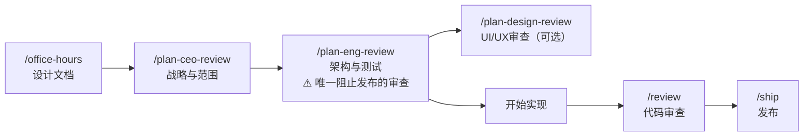

# `/plan-eng-review`

> **一句话定位：** 工程负责人视角的计划审查。在第一行代码写下之前，锁定架构、数据流、测试覆盖和性能方案——这是 gstack 中**唯一阻止发布的必须审查**。

---

## **概述**

`/plan-eng-review` 是 gstack Sprint 流程中的工程把关节点。它不做产品战略（那是 `/plan-ceo-review` 的工作），只做一件事：确保计划在技术层面是可执行的、可测试的、可观测的，并且不会在生产环境中悄悄炸掉。

**它不写代码。** 它只审查计划，逐节提问，等你确认后才继续。

**触发时机：**

- 你说"审查架构"、"工程审查"、"锁定计划"
- 你有了一个计划或设计文档，准备开始编码
- `/plan-ceo-review` 完成后，进入工程落地阶段

**使用顺序：** `/office-hours` → `/plan-ceo-review` → **`/plan-eng-review`** → 开始实现 → `/review` → `/ship`

---

## **核心工程偏好**

这些偏好贯穿整个审查，每一条建议都会映射回它们：

- **DRY 很重要**——积极标记重复，引用文件和行号
- **测试不可妥协**——宁可测试太多，不要太少
- **"足够工程化"**——不欠工程（脆弱、黑客式），也不过度工程（过早抽象、不必要的复杂性）
- **偏向处理更多边界情况**——周全 > 速度
- **显式优于聪明**——不要耍小聪明
- **最小 diff**——用最少的新抽象和文件改动实现目标

---

## **工程负责人的思维模式**

这些不是额外的检查项，而是有经验的工程领导者形成的直觉——在架构评估、复杂度判断、测试策略中自然运用。

**状态诊断** — 团队处于四种状态之一：落后、原地踏步、偿还技术债、创新。每种状态需要不同的干预（Larson《优雅的难题》）。

**爆炸半径本能** — 每个决策都要评估"最坏情况会影响多少系统/人"。

**默认无聊** — "每家公司大约有三个创新代币。" 其他一切都应该是经过验证的技术（McKinley《选择无聊的技术》）。

**增量优于革命** — 勒死榕树式替换，不是大爆炸。金丝雀发布，不是全量发布。重构，不是重写（Fowler）。

**系统优于英雄** — 为凌晨3点疲惫的人类设计，不是为你最好的工程师在最好的状态下设计。

**可逆性偏好** — 功能标志、A/B测试、增量发布。让犯错的代价变低。

**失败是信息** — 无责事后复盘、错误预算、混沌工程。事故是学习机会，不是追责事件（Allspaw，Google SRE）。

**本质复杂度 vs 偶然复杂度** — 在添加任何东西之前问："这是在解决真实问题还是我们自己制造的问题？"（Brooks《没有银弹》）

**让变更容易，再做容易的变更** — 先重构，再实现。永远不要同时进行结构性和行为性变更（Beck）。

---

## **完整工作流程**

### **开始前：设计文档检查**

技能首先检查是否存在来自 `/office-hours` 的设计文档：

```bash
DESIGN=$(ls -t ~/.gstack/projects/$SLUG/*-$BRANCH-design-*.md 2>/dev/null | head -1)
```

如果找到设计文档，读取它，作为问题陈述、约束条件和已选方案的事实来源。

**如果没有设计文档：** 会询问你是否要先运行 `/office-hours`（推荐，约10分钟），或直接进行标准审查。设计文档是针对具体功能的，不是针对整个产品的——它捕获的是这次具体变更背后的思考。

---

### **第0步：范围挑战（Scope Challenge）**

在审查任何内容之前，先回答这些问题：

**1. 现有代码利用**

哪些现有代码已经部分或完全解决了每个子问题？能否从现有流程中捕获输出，而不是构建并行流程？

**2. 最小变更集**

实现既定目标所需的最小变更集是什么？哪些工作可以推迟而不阻碍核心目标？对范围蔓延要毫不留情。

**3. 复杂度检查**

如果计划触及超过8个文件，或引入超过2个新类/服务，这是一个代码味道。挑战是否可以用更少的活动部件实现相同目标。如果触发了这个检查，会主动通过 AskUserQuestion 推荐范围缩减——解释什么过度构建了，提出达到核心目标的最小版本，询问是否缩减或按原计划继续。

**4. 搜索检查**

对计划引入的每个架构模式、基础设施组件或并发方案：

- 运行时/框架是否有内置功能？
- 所选方案是否是当前最佳实践？
- 是否有已知的陷阱？

如果计划在内置功能存在的情况下自己实现，标记为范围缩减机会。建议标注为 **[Layer 1]**（成熟方案）、**[Layer 2]**（新兴方案）、**[Layer 3]**（第一性原理）或 **[EUREKA]**。

**5. TODOS 交叉引用**

读取 `TODOS.md`（如果存在）：是否有推迟的工作阻塞了这个计划？是否有推迟的工作可以在不扩展范围的情况下捆绑进这个PR？这个计划是否创造了应该作为TODO捕获的新工作？

**6. 完整性检查**

计划是在做完整版本还是走捷径？使用AI辅助编码，完整性（100%测试覆盖、完整边界情况处理、完整错误路径）的成本比人类团队便宜10-100倍。如果计划提出的捷径节省了人类小时数，但使用 CC+gstack 只节省几分钟，推荐完整版本。

**7. 分发检查**

如果计划引入新的制品类型（CLI二进制文件、库包、容器镜像、移动应用），是否包含构建/发布流水线？没有分发的代码是没人能用的代码。检查：

- 是否有CI/CD工作流用于构建和发布制品？
- 目标平台是否已定义（linux/darwin/windows，amd64/arm64）？
- 用户如何下载或安装它（GitHub Releases、包管理器、容器注册表）？

---

### **第1节：架构审查**

评估：

- 整体系统设计和组件边界
- 依赖关系图和耦合关注点
- 数据流模式和潜在瓶颈
- 扩展特性和单点故障
- 安全架构（认证、数据访问、API边界）
- 哪些关键流程值得在计划或代码注释中使用ASCII图表
- **对每个新代码路径或集成点**，描述一个现实的生产失败场景，以及计划是否考虑了它
- **分发架构**：如果引入了新制品，它如何被构建、发布和更新？CI/CD流水线是计划的一部分还是推迟了？

每个发现的问题单独提问，等待回答后才进行下一节。

---

### **第2节：代码质量审查**

评估：

- 代码组织和模块结构（新代码是否符合现有模式？）
- DRY违规——积极标记，引用文件和行号
- 错误处理模式和缺失的边界情况（明确列出）
- 技术债务热点
- 相对于工程偏好，过度工程或欠工程的区域
- 被修改文件中现有的ASCII图表——这次变更后它们还准确吗？

**图表维护是变更的一部分。** 修改附近有ASCII图表注释的代码时，检查这些图表是否仍然准确，并在同一次提交中更新它们。过期的图表比没有图表更糟糕——它们会主动误导人。

---

### **第3节：测试审查**

这是 `/plan-eng-review` 中最详细的章节。目标是100%覆盖率。

#### **测试框架检测**

先检测项目的测试框架：

1. 读取 `CLAUDE.md` 中的 `## Testing` 节
2. 如果没有，自动检测：查找 `Gemfile`、`package.json`、`go.mod`、`Cargo.toml` 等，以及 `jest.config.*`、`.rspec`、`pytest.ini` 等配置文件

#### **第1步：追踪计划中的每条代码路径**

读取计划文档，对每个新功能、服务、端点或组件，追踪数据如何流经代码：

1. **读取计划**——理解每个计划组件的功能以及它如何连接到现有代码
2. **追踪数据流**——从每个入口点（路由处理器、导出函数、事件监听器、组件渲染）开始，跟随数据经过每个分支：
   - 输入来自哪里？（请求参数、props、数据库、API调用）
   - 什么在转换它？（验证、映射、计算）
   - 它去哪里？（数据库写入、API响应、渲染输出、副作用）
   - 每一步可能出什么问题？（null/undefined、无效输入、网络失败、空集合）
3. **绘制执行图**——对每个变更的文件，绘制ASCII图表，显示：每个添加或修改的函数/方法、每个条件分支（if/else、switch、三元、守卫子句、提前返回）、每个错误路径（try/catch、rescue、错误边界、回退）、每个对其他函数的调用（追踪进去——它有未测试的分支吗？）

#### **第2步：映射用户流程、交互和错误状态**

代码覆盖率还不够，还需要覆盖真实用户如何与变更代码交互：

**用户流程：** 用户采取什么操作序列会触及这段代码？映射完整旅程（例如"用户点击'支付'→表单验证→API调用→成功/失败界面"）。旅程中的每一步都需要一个测试。

**交互边界情况：**

- 双击/快速重复提交
- 操作进行中导航离开（后退按钮、关闭标签页、点击其他链接）
- 使用过期数据提交（页面开着30分钟，会话过期）
- 慢连接（API需要10秒——用户看到什么？）
- 并发操作（两个标签页，同一个表单）

**用户可见的错误状态：** 对于代码处理的每个错误，用户实际体验到什么？

- 是否有清晰的错误消息还是静默失败？
- 用户能否恢复（重试、返回、修复输入）还是卡住了？
- 没有网络时会怎样？API返回500时？服务器返回无效数据时？

**空/零/边界状态：** 零结果时UI显示什么？10,000条结果时？单字符输入时？最大长度输入时？

#### **第3步：逐分支检查现有测试**

逐个检查图表中的每个分支（代码路径和用户流程）。质量评分标准：

- ★★★ 测试了行为，包含边界情况和错误路径
- ★★ 测试了正确行为，仅快乐路径
- ★ 冒烟测试/存在性检查/琐碎断言（例如"它渲染了"、"它没有抛出"）

#### **E2E测试决策矩阵**

判断每个分支应该用单元测试还是E2E/集成测试：

**推荐E2E（在图表中标注 [→E2E]）：**

- 跨越3个以上组件/服务的常见用户流程（例如注册→验证邮件→首次登录）
- 模拟会隐藏真实失败的集成点（例如API→队列→工作进程→DB）
- 认证/支付/数据销毁流程——太重要了，不能只信任单元测试

**推荐Eval（在图表中标注 [→EVAL]）：**

- 需要质量评估的关键LLM调用（例如提示词变更→测试输出仍然满足质量标准）
- 对提示词模板、系统指令或工具定义的变更

**坚持单元测试：**

- 输入/输出清晰的纯函数
- 没有副作用的内部辅助函数
- 单个函数的边界情况（null输入、空数组）
- 不面向客户的晦涩/罕见流程

#### **回归规则（强制）**

**铁律：** 当覆盖率审计识别出回归——之前可以工作但diff破坏了的代码——必须将回归测试作为关键需求添加到计划中。不问问题，不跳过。回归是最高优先级的测试，因为它们证明了某些东西坏了。

#### **第4步：输出ASCII覆盖率图表**

图表中同时包含代码路径和用户流程，标注E2E和Eval路径：

```
代码路径覆盖率
===========================
[+] src/services/billing.ts
│
├── processPayment()
│   ├── [★★★ 已测试] 快乐路径+卡被拒绝+超时 — billing.test.ts:42
│   ├── [缺口] 网络超时 — 无测试
│   └── [缺口] 无效货币 — 无测试
│
└── refundPayment()
    ├── [★★ 已测试] 全额退款 — billing.test.ts:89
    └── [★ 已测试] 部分退款（仅检查不抛出）— billing.test.ts:101

用户流程覆盖率
===========================
[+] 支付结账流程
│
├── [★★★ 已测试] 完成购买 — checkout.e2e.ts:15
├── [缺口] [→E2E] 双击提交 — 需要E2E，不只是单元测试
├── [缺口] 支付过程中导航离开 — 单元测试足够
└── [★ 已测试] 表单验证错误（仅检查渲染）— checkout.test.ts:40

─────────────────────────────────
覆盖率：5/13条路径已测试（38%）
代码路径：3/5（60%）
用户流程：2/8（25%）
质量：★★★: 2  ★★: 2  ★: 1
缺口：8条路径需要测试（2个需要E2E，1个需要Eval）
─────────────────────────────────
```

#### **第5步：将缺失的测试添加到计划中**

对图表中识别的每个缺口，向计划中添加测试需求，具体说明：

- 创建什么测试文件（匹配现有命名约定）
- 测试应该断言什么（具体的输入→预期的输出/行为）
- 是单元测试、E2E测试还是Eval（使用决策矩阵）
- 对于回归：标记为**严重**并解释什么坏了

#### **测试计划制品**

产出覆盖率图表后，将测试计划写入项目目录，供 `/qa` 和 `/qa-only` 使用：

```
~/.gstack/projects/{项目名}/{用户}-{分支}-eng-review-test-plan-{时间戳}.md
```

格式包含：受影响的页面/路由、需要验证的关键交互、边界情况、关键路径。只包含帮助QA测试人员了解**测试什么和在哪里测试**的信息——不包含实现细节。

---

### **第4节：性能审查**

评估：

- N+1查询和数据库访问模式（每个新的关联遍历：是否有 includes/preload？）
- 内存使用关注点（每个新数据结构：生产中的最大大小？）
- 缓存机会（每个昂贵的计算或外部调用：是否应该缓存？）
- 慢速或高复杂度代码路径

---

### **外部声音——独立计划挑战（可选，推荐）**

所有审查章节完成后，提供来自不同AI系统的独立第二意见。

如果 Codex 可用，调用它；否则使用 Claude 子代理。提示词要求它找出：

- 在审查严格审查后仍然存在的逻辑漏洞和未陈述的假设
- 过度复杂性（是否有一个审查因为陷入细节而没有看到的根本性更简单方法？）
- 审查认为理所当然的可行性风险
- 缺失的依赖或排序问题
- 战略错误校准（这是正确的构建对象吗？）

如果外部声音与审查发现有分歧，标注为"跨模型张力"并逐一询问是否加入TODOS.md。

---

### **必须产出的输出**

#### **"不在范围内"章节**

每次计划审查都必须产出这个章节，列出被考虑并明确推迟的工作，每项一行理由。

#### **"已存在什么"章节**

列出已经部分解决计划中子问题的现有代码/流程，以及计划是否复用它们或不必要地重建了它们。

#### **TODOS.md 更新**

每个潜在TODO作为独立问题提出，包含：做什么、为什么、优点、缺点、上下文、依赖项。三个选项：A）加入TODOS.md B）跳过——价值不够 C）现在就在这个PR中构建而不是推迟。

**不要只是附加模糊的要点。没有上下文的TODO比没有TODO更糟糕**——它制造了想法被捕获的虚假信心，同时实际上丢失了推理。

#### **图表**

计划本身应该为任何非简单的数据流、状态机或处理流水线使用ASCII图表。同时识别实现中哪些文件应该获得内联ASCII图表注释——特别是有复杂状态转换的模型、有多步骤流水线的服务、有非显而易见混入行为的关注点。

#### **失败模式**

对测试审查图表中识别的每条新代码路径，列出一种在生产中可能失败的现实方式（超时、nil引用、竞态条件、过期数据等），以及：

1. 是否有测试覆盖该失败
2. 是否存在错误处理
3. 用户会看到清晰的错误还是静默失败

如果任何失败模式**没有测试、没有错误处理、且会静默发生**，标记为**严重缺口**。

#### **工作树并行化策略**

分析计划的实现步骤，寻找并行执行机会，帮助用户在git工作树之间分割工作。

如果所有步骤都触及同一个主要模块，或计划少于2个独立工作流，则写"顺序实现，无并行化机会"。

否则，产出：

**依赖表：**

| 步骤         | 触及的模块            | 依赖于   |
| ------------ | --------------------- | -------- |
| 添加API端点  | controllers/, models/ | —        |
| 构建前端组件 | components/, pages/   | —        |
| 集成测试     | tests/                | 以上两者 |

**并行通道：**

```
通道A：步骤1 → 步骤3（顺序，共享models/）
通道B：步骤2（独立）

执行顺序：并行启动A+B。合并两者。然后C。
```

**冲突标记：** 如果两个并行通道触及同一个模块目录，标记它："通道X和Y都触及module/——潜在合并冲突。考虑顺序执行或仔细协调。"

#### **完成摘要**

```
- 第0步：范围挑战 — ___ （范围按原样接受 / 按建议缩减）
- 架构审查：___ 个问题发现
- 代码质量审查：___ 个问题发现
- 测试审查：图表已产出，___ 个缺口识别
- 性能审查：___ 个问题发现
- 不在范围内：已写
- 已存在什么：已写
- TODOS.md更新：___ 个项目向用户提出
- 失败模式：___ 个严重缺口标记
- 外部声音：已运行（codex/claude）/ 已跳过
- 并行化：___ 个通道，___ 个并行 / ___ 个顺序
- 湖分数：X/Y个建议选择了完整选项
```

---

### **审查就绪仪表板**

审查完成后，显示与 `/plan-ceo-review` 相同格式的仪表板，展示所有审查的运行状态。

工程审查是**唯一阻止发布的审查**——只有它通过，`/ship` 才会放行。可以通过 `gstack-config set skip_eng_review true` 全局禁用（"别烦我"设置）。

**陈旧性检测：** 如果任何现有审查的提交哈希与当前 HEAD 不同，会显示警告："注意：{技能}审查来自{日期}可能已陈旧——审查后有{N}次提交"。

---

### **下一步：审查链接**

审查完成后，根据发现的内容推荐后续步骤：

- **如果检测到UI变更且没有设计审查：** 建议运行 `/plan-design-review`
- **如果是重大产品变更且没有CEO审查：** 软性建议运行 `/plan-ceo-review`（可选，不强推）
- **如果没有需要额外审查的内容：** 说"所有相关审查完成。完成实现后运行 `/ship`。"

---

## **与其他技能的关系**



`/plan-eng-review` 产出的测试计划文件（`eng-review-test-plan-*.md`）会被 `/qa` 和 `/qa-only` 自动读取，作为测试输入。这是 gstack 技能之间数据流传递的一个典型例子——每个技能的输出都成为下一个技能的输入，确保从计划到发布没有任何东西掉落。

## 源码目录

gstack 仓库内技能实现目录：[`plan-eng-review/`](https://github.com/garrytan/gstack/tree/main/plan-eng-review)
