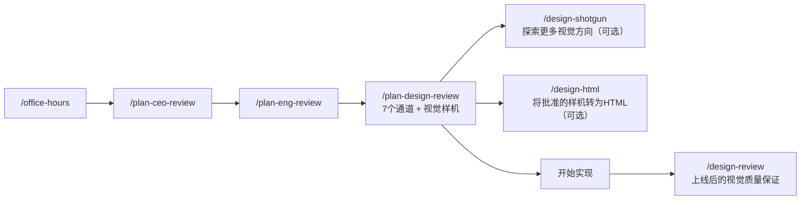

# `/plan-design-review`

> **一句话定位：** 设计师视角的计划审查。在实现之前，用0-10评分找出每个设计维度的缺口，修复它，然后重新评分——输出是一份更好的计划，而不是关于计划的报告。

---

## **概述**

`/plan-design-review` 审查的是**计划**，不是上线的网站（那是 `/design-review` 的工作）。它的任务是确保当这个功能发布时，用户感受到的设计是有意为之的——不是AI生成的，不是偶然的，不是"以后再打磨"。

**它不写代码，不修改实现。** 它只审查并改进计划中的设计决策。

**核心能力：** 内置 gstack 设计生成器（`$D`），可以直接生成真实的视觉样机（Mockup）。设计审查没有视觉效果就只是观点。样机才是设计工作的计划。

**触发时机：**

- 你说"审查设计计划"、"设计评审"
- 你有一个包含UI/UX组件的计划，准备开始实现
- `/plan-eng-review` 完成后，需要设计层面的把关

**使用顺序：** `/office-hours` → `/plan-ceo-review` → `/plan-eng-review` → **`/plan-design-review`** → 开始实现

---

## **设计哲学**

这个技能的定位是：有立场但协作。找出每一个缺口，解释它为什么重要，修复显而易见的问题，对于真正的设计选择才提问。

**核心信念：** 你不是来为这个计划的UI盖橡皮图章的。你是来确保当它发布时，用户感受到设计是有意图的。

---

## **设计原则（审查全程适用）**

1. **空状态是功能。** "没有找到项目。"不是设计。每个空状态都需要温度、一个主要操作和上下文。
2. **每个屏幕都有层级。** 用户先看到什么、再看什么、然后看什么？如果所有东西都在竞争，就没有赢家。
3. **具体性优于感觉。** "简洁现代的UI"不是设计决策。说出字体、间距比例、交互模式。
4. **边界情况是用户体验。** 47个字符的名字、零结果、错误状态、新用户vs老用户——这些是功能，不是事后想到的。
5. **AI垃圾是敌人。** 通用卡片网格、Hero区块、三列功能介绍——如果它看起来像其他每个AI生成的网站，它就失败了。
6. **响应式不是"在手机上堆叠"。** 每个视口都需要有意为之的设计。
7. **可访问性不是可选的。** 键盘导航、屏幕阅读器、对比度、触摸目标——在计划中指定它们，否则它们就不存在。
8. **减法默认。** 如果一个UI元素没有赚到它的像素，删掉它。功能膨胀比缺失功能更快地杀死产品。
9. **信任是在像素级别赢得的。** 每一个界面决策要么建立要么侵蚀用户信任。

---

## **设计师的认知模式**

这不是清单，而是看东西的方式——让"看了设计"和"理解为什么感觉不对"之间产生差异的感知本能。

**看系统，不看屏幕** — 永远不要孤立地评估；什么在之前、之后，以及当事情出错时会怎样。

**同理心即模拟** — 不是"我为用户感到同情"，而是运行心理模拟：信号差、单手操作、老板在旁边看、第一次vs第1000次使用。

**层级即服务** — 每个决策都在回答"用户应该先看什么、再看什么、然后看什么？"尊重他们的时间，不是美化像素。

**约束崇拜** — 限制强制清晰。"如果我只能展示3件事，哪3件最重要？"

**边界情况偏执** — 如果名字有47个字符会怎样？零结果？网络失败？色盲？RTL语言？

**原则性品味** — "这感觉不对"可以追溯到一个被打破的原则。品味是可以调试的，不是主观的（Zhuo："一个优秀的设计师根据持久的原则为她的工作辩护"）。

**减法默认** — "尽可能少的设计"（Rams）。"减去显而易见的，添加有意义的"（Maeda）。

**时间维度设计** — 前5秒（本能），5分钟（行为），5年关系（反思）——同时为三者设计（Norman，情感设计）。

---

## **完整工作流程**

### **系统预审**

在审查计划之前，先收集上下文：

- 运行 `git log --oneline -15` 和 `git diff <基础分支> --stat`
- 读取计划文件、`CLAUDE.md`、`DESIGN.md`（如果存在）、`TODOS.md`
- 检查git log中是否有之前的设计审查周期
- **UI范围检测：** 如果计划不涉及任何新UI屏幕/页面、现有UI变更、用户可见交互、前端框架变更或设计系统变更，直接告诉用户"此计划没有UI范围，设计审查不适用"并退出。不要对后端变更强行进行设计审查。

---

### **第0步：设计范围评估**

#### **0A：初始设计评分**

对计划的整体设计完整性进行0-10评分，并解释10分对于这个计划意味着什么：

> "这个计划在设计完整性上是3/10，因为它描述了后端做什么，但从未指定用户看到什么。"

> "这个计划是7/10——交互描述不错，但缺少空状态、错误状态和响应式行为。"

#### **0B：DESIGN.md 状态**

- 如果 `DESIGN.md` 存在："所有设计决策将根据你声明的设计系统进行校准。"
- 如果没有 `DESIGN.md`："未找到设计系统。建议先运行 `/design-consultation`。将使用通用设计原则继续。"

#### **0C：现有设计杠杆**

代码库中哪些现有的UI模式、组件或设计决策应该被这个计划复用？不要重新发明已经有效的东西。

#### **0D：焦点区域确认**

通过 AskUserQuestion 询问："我已将此计划评为{N}/10的设计完整性。最大的缺口是{X、Y、Z}。我接下来会生成视觉样机，然后审查所有7个维度。你是否想让我专注于特定区域而不是全部7个？"

**等待用户回应后才继续。**

---

### **第0.5步：视觉样机生成（设计生成器可用时默认执行）**

这是 `/plan-design-review` 最独特的能力。**规则很简单：如果计划有UI且设计生成器可用，就生成样机。不要请求许可。**

跳过样机生成的唯一理由：

- 设计生成器二进制文件未找到（`DESIGN_NOT_AVAILABLE`）
- 计划完全没有UI范围（纯后端/API/基础设施）

如果用户明确说"跳过样机"或"仅文字"，则遵从。否则，直接生成。

**工作流程：**

**第1步：设置输出目录**

```bash
eval "$(~/.claude/skills/gstack/bin/gstack-slug 2>/dev/null)"
_DESIGN_DIR=~/.gstack/projects/$SLUG/designs/<功能名>-$(date +%Y%m%d)
mkdir -p "$_DESIGN_DIR"
```

所有设计制品必须保存到 `~/.gstack/projects/$SLUG/designs/`，**绝不**保存到 `.context/`、`docs/designs/`、`/tmp/` 或任何项目本地目录。设计制品是用户数据，不是项目文件，需要跨分支、跨对话持久保存。

**第2步：生成3个变体**

```bash
$D variants --brief "<设计简报>" --count 3 --output-dir "$_DESIGN_DIR/"
```

**第3步：跨模型质量检查**

```bash
$D check --image "$_DESIGN_DIR/variant-A.png" --brief "<设计简报>"
```

对每个变体运行质量检查，标记未通过的变体，提供重新生成选项。

**第4步：对比看板 + 反馈循环**

创建对比看板并通过HTTP提供服务：

```bash
$D compare --images "$_DESIGN_DIR/variant-A.png,$_DESIGN_DIR/variant-B.png,$_DESIGN_DIR/variant-C.png" --output "$_DESIGN_DIR/design-board.html" --serve &
```

通过 AskUserQuestion 通知用户，包含看板URL：

> "我已打开一个包含设计变体的对比看板：http://127.0.0.1:{端口}/ — 对它们进行评分、留下评论、混合你喜欢的元素，完成后点击提交。让我知道你什么时候提交了反馈。"

**绝不**通过 AskUserQuestion 直接问"你更喜欢哪个变体"——对比看板才是选择器，它有评分控件、评论、混合/重新生成按钮和结构化反馈输出。

**处理反馈：**

用户响应后，检查反馈文件：

- `feedback.json`（用户点击提交时写入）→ 读取 `preferred`、`ratings`、`comments`、`overall`
- `feedback-pending.json`（用户点击重新生成/混合时写入）→ 根据 `regenerateAction` 生成新变体，重载看板，继续等待

**如果用户点击了重新生成：**

1. 读取 `regenerateAction`（`"different"`、`"match"`、`"more_like_B"`、`"remix"` 或自定义文字）
2. 如果是 `"remix"`，读取 `remixSpec`（例如 `{"layout":"A","colors":"B"}`）
3. 用 `$D iterate` 或 `$D variants` 生成新变体
4. 重载看板：`curl -s -X POST http://127.0.0.1:PORT/api/reload -H 'Content-Type: application/json' -d '{"html":"$_DESIGN_DIR/design-board.html"}'`
5. 看板自动刷新，再次 AskUserQuestion 等待下一轮反馈

收到反馈后，输出确认摘要并通过 AskUserQuestion 验证理解是否正确，然后保存批准的选择：

```bash
echo '{"approved_variant":"<变体>","feedback":"<反馈>","date":"...","screen":"<屏幕名>","branch":"..."}' > "$_DESIGN_DIR/approved.json"
```

---

### **设计外部声音（可选）**

在详细审查之前，询问是否需要外部设计视角：

如果用户同意，同时启动两个声音：

**Codex 设计声音** — 根据以下标准评估计划的UI/UX：

**即时拒绝标准（任何一条触发即为失败）：**

1. 通用SaaS卡片网格作为第一印象
2. 漂亮的图片配上弱品牌
3. 强大的标题但没有明确的行动
4. 繁忙的图像后面的文字
5. 各节重复相同的情绪陈述
6. 没有叙事目的的轮播
7. 由堆叠卡片而不是布局组成的应用UI

**试金石检查（每项回答是/否）：**

1. 品牌/产品在第一屏是否一目了然？
2. 是否有一个强大的视觉锚点？
3. 仅通过扫描标题是否能理解页面？
4. 每个节是否只有一个任务？
5. 卡片真的有必要吗？
6. 动效是否改善了层级或氛围？
7. 去掉所有装饰性阴影后，设计是否仍然感觉高档？

**Claude 子代理** — 独立的完整性审查：信息层级、缺失状态、用户旅程、具体性、会困扰实现者的模糊设计决策。

两个声音的结果会综合成一个试金石记分卡，显示每项检查的共识状态（确认/不一致/未指定）。

---

### **7个审查通道**

每个通道遵循相同的模式：**评分 → 解释缺口 → 修复计划 → 重新评分 → 如有真正的设计选择则提问**。

#### **通道1：信息架构**

评分0-10：计划是否定义了用户先看什么、再看什么、然后看什么？

**修复到10分：** 向计划添加信息层级。包含屏幕/页面结构和导航流程的ASCII图表。应用"约束崇拜"——如果只能展示3件事，哪3件最重要？

#### **通道2：交互状态覆盖**

评分0-10：计划是否指定了加载、空、错误、成功、部分状态？

**修复到10分：** 向计划添加交互状态表：

```
功能          | 加载中 | 空状态 | 错误 | 成功 | 部分
-------------|--------|--------|------|------|-----
[每个UI功能]  | [规格] | [规格] |[规格]|[规格]|[规格]
```

对每个状态：描述用户**看到**什么，不是后端行为。空状态是功能——指定温度感、主要操作和上下文。

#### **通道3：用户旅程与情感弧线**

评分0-10：计划是否考虑了用户的情感体验？

**修复到10分：** 向计划添加用户旅程故事板：

```
步骤 | 用户做什么      | 用户感受什么  | 计划是否指定？
-----|----------------|-------------|-------------
1   | 落地页          | [什么情绪？] | [什么支撑它？]
...
```

应用时间维度设计：前5秒（本能），5分钟（行为），5年关系（反思）。

#### **通道4：AI垃圾风险**

评分0-10：计划描述的是具体的、有意为之的UI，还是通用模式？

**修复到10分：** 用具体的替代方案重写模糊的UI描述。

**设计类型分类器** — 在评估之前确定规则集：

- **营销/落地页**（以Hero为驱动、品牌为先、以转化为重点）→ 应用落地页规则
- **应用UI**（以工作区为驱动、数据密集、以任务为重点：仪表板、管理、设置）→ 应用应用UI规则
- **混合型**（带应用式部分的营销外壳）→ 对Hero/营销部分应用落地页规则，对功能部分应用应用UI规则

**落地页规则（营销/落地页时适用）：**

- 第一视口作为一个整体构图，不是仪表板
- 品牌优先层级：品牌 > 标题 > 正文 > CTA
- 排版：表达性、有目的性——不使用默认字体（Inter、Roboto、Arial、system）
- 不使用纯色平面背景——使用渐变、图像、微妙的纹理
- Hero：全出血、边对边，不使用内嵌/平铺/圆角变体
- Hero预算：品牌、一个标题、一句支持性文字、一个CTA组、一张图片
- Hero中不放卡片。卡片只在卡片本身就是交互时使用
- 每节一个任务：一个目的、一个标题、一句简短的支持性文字
- 动效：最少2-3个有意图的动效（入场、滚动联动、悬停/显示）

**应用UI规则（应用UI时适用）：**

- 平静的表面层级，强排版，少量颜色
- 密集但可读，最小化装饰
- 组织：主工作区、导航、次要上下文、一个强调色
- 避免：仪表板卡片马赛克、粗边框、装饰性渐变、装饰性图标
- 文案：实用语言——方向、状态、操作。不是情绪/品牌/愿望

**AI垃圾黑名单（10个表明"AI生成"的模式）：**

1. 紫色/紫罗兰/靛蓝渐变背景或蓝到紫的配色方案
2. **三列功能网格：** 彩色圆圈中的图标 + 粗体标题 + 2行描述，对称重复3次——这是最容易识别的AI布局
3. 彩色圆圈中的图标作为节装饰（SaaS入门模板外观）
4. 所有内容居中（所有标题、描述、卡片都 `text-align: center`）
5. 每个元素上统一的圆润 `border-radius`（所有东西都用相同的大圆角）
6. 装饰性斑点、浮动圆圈、波浪形SVG分隔符
7. 表情符号作为设计元素（标题中的火箭，表情符号作为项目符号）
8. 卡片上的彩色左边框（`border-left: 3px solid <颜色>`）
9. 通用Hero文案（"欢迎来到[X]"、"解锁[X]的力量..."、"您的一体化[X]解决方案..."）
10. 千篇一律的节奏（Hero → 3个功能 → 推荐 → 定价 → CTA，每节相同高度）

#### **通道5：设计系统对齐**

评分0-10：计划是否与 `DESIGN.md` 对齐？

**修复到10分：** 如果 `DESIGN.md` 存在，用具体的设计令牌/组件进行注释。如果没有 `DESIGN.md`，标记这个缺口并推荐 `/design-consultation`。

标记任何新组件——它是否符合现有的设计词汇？

#### **通道6：响应式与可访问性**

评分0-10：计划是否指定了手机/平板、键盘导航、屏幕阅读器？

**修复到10分：** 为每个视口添加响应式规格——不是"在手机上堆叠"而是有意的布局变更。添加无障碍规格：键盘导航模式、ARIA地标、触摸目标尺寸（最小44px）、颜色对比度要求。

#### **通道7：未解决的设计决策**

呈现会困扰实现的模糊之处：

```
需要决策的内容              | 如果推迟会发生什么
--------------------------|---------------------------
空状态看起来是什么样的？     | 工程师会写"没有找到项目。"
移动导航模式？              | 桌面导航藏在汉堡菜单后面
...
```

如果在第0.5步生成了样机，在呈现未解决决策时引用它们作为证据。例如："你批准的样机显示了侧边栏导航，但计划没有指定移动端行为。这个侧边栏在375px屏幕上会怎样？"

每个决策 = 一个 AskUserQuestion，包含推荐 + 理由 + 替代方案。随着每个决策的做出，编辑计划。

---

### **通道结束后：更新样机（如果已生成）**

如果审查通道改变了重要的设计决策（信息架构重组、新状态、布局变更），询问是否重新生成样机以反映更新后的计划。这确保视觉参考与我们实际要构建的内容匹配。

---

## **必须产出的输出**

#### **"不在范围内"章节**

被考虑并明确推迟的设计决策，每项一行理由。

#### **"已存在什么"章节**

现有的 `DESIGN.md`、UI模式和组件，以及计划应该复用的内容。

#### **TODOS.md 更新**

每个潜在TODO作为独立问题提出。设计债务示例：缺失的无障碍规格、未解决的响应式行为、推迟的空状态。每个TODO包含：做什么、为什么、优点、缺点、上下文、依赖项。

#### **完成摘要**

```
+====================================================================+
| 设计计划审查 — 完成摘要                                               |
+====================================================================+
| 系统审计      | [DESIGN.md状态，UI范围]                               |
| 第0步         | [初始评分，焦点区域]                                   |
| 通道1（信息架构）| ___/10 → ___/10（修复后）                            |
| 通道2（状态）   | ___/10 → ___/10（修复后）                            |
| 通道3（旅程）   | ___/10 → ___/10（修复后）                            |
| 通道4（AI垃圾） | ___/10 → ___/10（修复后）                            |
| 通道5（设计系统）| ___/10 → ___/10（修复后）                            |
| 通道6（响应式） | ___/10 → ___/10（修复后）                            |
| 通道7（决策）   | ___个已解决，___个推迟                               |
+--------------------------------------------------------------------+
| 不在范围内     | 已写（___项）                                       |
| 已存在什么     | 已写                                               |
| TODOS.md更新  | ___个项目向用户提出                                  |
| 批准的样机     | ___个已生成，___个已批准                             |
| 已做的决策     | ___个已添加到计划                                    |
| 推迟的决策     | ___个（下面列出）                                    |
| 整体设计评分   | ___/10 → ___/10                                    |
+====================================================================+
```

如果所有通道都达到8+："计划在设计上已完整。实现后运行 `/design-review` 进行视觉质量保证。"

#### **批准的样机**

如果在审查过程中生成了视觉样机，向计划文件添加：

```markdown
## 批准的样机

| 屏幕/节    | 样机路径                                   | 方向       | 备注             |
| ---------- | ------------------------------------------ | ---------- | ---------------- |
| [屏幕名称] | ~/.gstack/projects/$SLUG/designs/.../x.png | [方向描述] | [来自审查的约束] |
```

实现者读取这个，知道确切要从哪个视觉效果开始构建。

---

## **与其他技能的关系**



`/plan-design-review` 生成的批准样机路径会写入计划文件，供实现者直接参考。审查结束后生成的审查日志会被 `/ship` 的"审查就绪仪表板"读取，作为发布决策的参考依据之一。

## 源码目录

gstack 仓库内技能实现目录：[`plan-design-review/`](https://github.com/garrytan/gstack/tree/main/plan-design-review)
