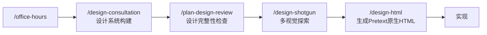

# `/design-consultation`

> **一句话定位：** 你的设计系统，共同构建。从零出发，理解你的产品，研究竞争格局，提出完整的设计系统方案（美学方向、字体、颜色、布局、间距、动效），并生成视觉预览。最终产出 `DESIGN.md`，作为整个项目设计决策的唯一事实来源。

---

## **概述**

`/design-consultation` 是 gstack 设计工具链的起点。它不是一个表单向导，而是一个有立场的设计顾问——它倾听、思考、研究，然后提出建议。整个过程是对话式的，你可以随时打断、调整、或者直接聊某个具体问题。

**与 `/plan-design-review` 的区别：**

- `/design-consultation` — 从零构建设计系统，产出 `DESIGN.md`
- `/plan-design-review` — 针对已有计划的设计完整性审查，产出更好的计划

**触发时机：**

- 你说"设计系统"、"品牌规范"、"创建 DESIGN.md"
- 新项目启动，没有现有设计系统或 `DESIGN.md`
- 需要从头确立产品的视觉语言

**在 Sprint 中的位置：** `/office-hours` 之后、开始实现之前。`DESIGN.md` 一旦创建，后续所有设计相关技能（`/plan-design-review`、`/design-review`、`/qa`）都会读取它。

---

## **核心工作姿态**

> **设计顾问，不是表单向导。** 提出一个完整连贯的方案，解释为什么它有效，然后欢迎你调整。

这意味着：

- 不展示选项菜单，而是直接给出有立场的推荐
- 每一条推荐都有理由
- 接受用户的最终选择，即使与建议不同
- 随时可以切换到自由对话模式

---

## **完整工作流程**

### **第0阶段：预检查**

**检查现有 DESIGN.md：**

```bash
ls DESIGN.md design-system.md 2>/dev/null || echo "NO_DESIGN_FILE"
```

- 如果已有 `DESIGN.md`：读取内容，询问是**更新**、**重新开始**还是**取消**
- 如果没有：直接继续

**从代码库收集产品上下文：**

```bash
cat README.md 2>/dev/null | head -50
cat package.json 2>/dev/null | head -20
ls src/ app/ pages/ components/ 2>/dev/null | head -30
```

同时检查是否有 `/office-hours` 产出的设计文档——如果存在，读取它，产品上下文就已经预填好了。

如果代码库是空的且目的不明确，会建议先运行 `/office-hours`，因为在知道产品方向之前设计系统没有意内容完整，整理输出。

---

# `/design-consultation` 技能完整中文文档

> **一句话定位：** 从零构建你的设计系统。理解产品 → 研究赛道 → 提出完整视觉体系 → 生成可视化预览 → 写出 `DESIGN.md` 作为设计源头真相。

这个技能不是审查现有设计（那是 `/plan-design-review` 和 `/design-review` 的工作）。

它是：**设计系统共创。**

---

## **它解决什么问题？**

当一个项目：

- 没有 `DESIGN.md`
- UI 还没开始
- 风格混乱
- 或你说“帮我做品牌 / 设计系统 / 视觉规范”

就运行 `/design-consultation`。

它会：

1. 理解你在做什么
2. 研究赛道（可选）
3. 提出完整视觉系统（不是零散建议）
4. 生成视觉预览（AI Mockup 或 HTML）
5. 写出标准化的 `DESIGN.md`
6. 更新 `CLAUDE.md` 强制后续遵守设计系统

它是整个 gstack 流程中“设计起点”的技能。

---

# 整体结构

```
Phase 0  预检查
Phase 1  产品上下文
Phase 2  研究（可选）
Phase 3  完整设计提案（核心）
Phase 4  局部深入
Phase 5  设计系统预览（AI Mockup 或 HTML）
Phase 6  写 DESIGN.md + 确认
```

---

# Phase 0：预检查

## ✅ 1. 检查是否已有 DESIGN.md

```bash
ls DESIGN.md design-system.md
```

如果存在：

> “你已经有设计系统。是要更新？重做？还是取消？”

如果不存在 → 继续。

---

## ✅ 2. 自动读取项目上下文

尝试读取：

- `README.md`
- `package.json`
- `src/`、`app/`、`components/`

同时查找 `/office-hours` 输出文件：

```
~/.gstack/projects/$SLUG/*office-hours*
```

如果存在 → 自动读取产品定位。

如果项目几乎是空的：

> “我还不知道你在做什么。要不要先跑 `/office-hours`，把产品方向搞清楚？”

---

## ✅ 3. 检查浏览器与设计生成器

### Browse（二进制）

用于真实网页竞品视觉研究。

### Design（二进制）

用于 AI Mockup 生成。

如果没有，也能运行，只是能力降级。

---

# Phase 1：产品上下文确认

只问一个问题，但包含所有关键点。

必须确认：

1. 产品是什么？
2. 谁用？
3. 行业/赛道？
4. 项目类型？
   - Web app
   - Dashboard
   - Marketing site
   - Internal tool
   - Editorial
5. 是否需要竞品研究？

并且明确说：

> “这不是表单流程。随时可以打断讨论，我们是一起设计。”

---

# Phase 2：研究（可选）

如果用户说要研究：

## Step 1：WebSearch 找 5–10 个竞品

搜索：

- “[category] website design”
- “best [industry] web apps 2025”

---

## Step 2：浏览器视觉研究（如果可用）

对 3–5 个站点：

```bash
$B goto URL
$B screenshot
$B snapshot
```

分析：

- 字体
- 颜色
- 布局
- 密度
- 风格倾向

---

## Step 3：三层综合分析

### Layer 1 — 行业共识（必须遵守）

所有竞品都在做的设计模式。

这些是用户预期。

---

### Layer 2 — 趋势层

当前流行什么？

- 渐变？
- 极简？
- 强排版？

---

### Layer 3 — 第一性原理

对这个产品来说：

> 行业默认做法是否错误？

如果发现突破点：

### EUREKA

> “所有 [行业] 产品都假设 X，但你的用户实际是 Y，所以我们应该反过来。”

会记录到 eureka 日志。

---

# Design Outside Voices（可选）

可以并行调用：

- Codex 设计方向
- Claude 子代理设计方向

输出：

```
CODEX SAYS
CLAUDE SUBAGENT SAYS
```

然后主模型整合：

- 共识点
- 分歧点
- 创意替代方案

这不是决策，是参考。

---

# Phase 3：完整设计提案（核心）

这是灵魂部分。

不是菜单。

是完整 coherent system。

---

## 提案结构

```
AESTHETIC
DECORATION
LAYOUT
COLOR
TYPOGRAPHY
SPACING
MOTION
```

然后：

### SAFE（行业基线）

- 2–3 个安全选择
- 为什么必须安全

### RISKS（产品独特性）

- 至少 2 个刻意突破
- 每个风险说明：
  - 获得什么
  - 失去什么
  - 为什么值得

---

## 可选方向库（内部知识）

### 审美方向

- Brutally Minimal
- Maximalist Chaos
- Retro-Futuristic
- Luxury / Refined
- Playful
- Editorial
- Brutalist
- Art Deco
- Organic
- Industrial

---

### 装饰等级

- minimal
- intentional
- expressive

---

### 布局方式

- grid-disciplined
- creative-editorial
- hybrid

---

### 色彩策略

- restrained
- balanced
- expressive

---

### 动效策略

- minimal-functional
- intentional
- expressive

---

## 字体规则

✅ 推荐：

- Satoshi
- General Sans
- Instrument Serif
- Geist
- DM Sans
- JetBrains Mono
- IBM Plex Mono

❌ 永不推荐：

- Papyrus
- Comic Sans
- Lobster
- Raleway
- Clash Display
- Courier New（正文）

⚠️ 过度使用字体（不做主字体）：

- Inter
- Roboto
- Helvetica
- Montserrat

---

## AI Slop 黑名单

永远不要：

- 紫色渐变
- 三列图标网格
- 全部居中
- 统一大圆角
- 渐变按钮
- stock hero
- “Built for X” 营销文案

---

# Coherence 校验机制

当用户修改某一项时：

会检查系统是否仍然一致。

例如：

- Brutalist + expressive motion → 不协调
- Editorial + 数据密集产品 → 可能冲突

但永远不会阻止用户。

---

# Phase 4：局部深入（按需）

如果用户说：

- “字体换一下”
- “颜色太激进”
- “想更野一点”

就单点深入。

每次只讨论一个模块。

然后重新检查 coherence。

---

# Phase 5：设计系统预览（默认开启）

有两条路径。

---

# ✅ Path A：AI Mockup（推荐）

如果 DESIGN_READY。

## 1. 创建设计目录

```
~/.gstack/projects/$SLUG/designs/design-system-YYYYMMDD/
```

## 2. 生成 3 个变体

```bash
$D variants --brief "..." --count 3
```

## 3. Vision 质量检查

```bash
$D check --image ...
```

## 4. Comparison Board

生成对比看板：

```
$D compare --serve
```

用户在浏览器里：

- 打分
- 评论
- 混合
- 重新生成

---

## 反馈循环

检测：

- feedback.json（最终选择）
- feedback-pending.json（请求重生）

直到确定方向。

---

## 保存 approved.json

包含：

- variant
- feedback
- branch
- 时间

---

## 提取设计 Token

```bash
$D extract
```

从视觉结果提取：

- 颜色
- 字体
- 间距
- token

写入 DESIGN.md。

---

## Plan Mode vs 非 Plan Mode

- Plan Mode → 写入计划文件
- 非 Plan Mode → 直接写 DESIGN.md

---

# ✅ Path B：HTML 预览页（fallback）

生成一个漂亮的单页 HTML。

要求：

- 加载 Google Fonts
- 使用真实产品名称
- 显示字体对比
- 显示颜色系统
- 展示组件（按钮/卡片/表单）
- 展示真实产品 mock 布局
- 支持 light/dark toggle
- 完全响应式

这是一个“卖设计系统”的页面。

不是 token 表格。

---

# Phase 6：写 DESIGN.md

结构如下：

```markdown
# Design System — Project

## Product Context

## Aesthetic Direction

## Typography

## Color

## Spacing

## Layout

## Motion

## Decisions Log
```

包含：

- 具体 hex
- 具体 px
- 具体字体加载方式
- 模块化 scale
- semantic colors
- dark mode 策略

---

## 更新 CLAUDE.md

追加：

````markdown
## Design System

Always read DESIGN.md before内容完整，整理输出。

---

# `/design-consultation` 技能完整中文文档

> **一句话定位：** 从零开始，为你的产品构建一套完整、可执行、可落地的设计系统，并生成真实可视化预览。最终产出 `DESIGN.md`，成为项目的设计“源代码”。

---

## **概述**

`/design-consultation` 不是“设计审查”，而是**设计共创**。

如果 `/plan-design-review` 是评估已有计划是否设计完整，那么 `/design-consultation` 是：

- 理解你的产品
- 研究行业视觉格局
- 提出完整一致的设计系统（美学、字体、颜色、布局、间距、动效）
- 生成真实视觉预览（AI mockup 或 HTML 页面）
- 写出 `DESIGN.md`，成为未来所有 UI 决策的标准

**触发时机：**

- 你说“设计系统”“品牌规范”“创建 DESIGN.md”
- 新项目刚开始，没有设计系统
- 你想让产品有独特的视觉身份，而不是默认 Tailwind + Inter

---

## **核心定位**

你是和一个“强烈有观点的资深设计顾问”对话。

不是问卷机器人。  
不是模板生成器。

他会：

- 提出完整、连贯的视觉系统
- 解释为什么这么设计
- 指出哪些是安全选择，哪些是风险选择
- 欢迎你挑战和修改

**这是对话，不是流程。**

---

# 完整工作流程

---

## **Phase 0：预检查**

### ✅ 1. 检查是否已有 DESIGN.md

```bash
ls DESIGN.md design-system.md
```
````

- 如果存在 → 询问：
  - 更新？
  - 推翻重来？
  - 取消？

- 如果不存在 → 继续

---

### ✅ 2. 自动收集产品上下文

读取：

- README.md
- package.json
- src/ / pages/ / components/
- 是否存在 `/office-hours` 输出

如果找不到产品方向，会建议：

> “我还不太清楚你在做什么。要不要先跑一下 `/office-hours`，我们先把产品想清楚？”

---

### ✅ 3. 检查可选能力

#### 浏览能力（用于竞品视觉研究）

如果 browse 可用，可以：

```bash
$B goto "https://example.com"
$B screenshot
$B snapshot
```

抓真实视觉证据。

#### 设计生成器能力（用于AI mockup）

如果 `$D` 可用，Phase 5 将生成真实 AI mockup，而不是 HTML 预览。

---

# **Phase 1：产品上下文确认**

只问一个综合问题。

必须包含：

1. 产品是什么？
2. 面向谁？
3. 属于什么行业？
4. 项目类型（web app / dashboard / marketing site / 内部工具）
5. 是否需要竞品研究？

并明确说：

> “随时可以脱离流程，我们可以直接聊。这不是表单，是对话。”

---

# **Phase 2：行业研究（可选）**

只有在用户说“要研究”时执行。

---

## ✅ Step 1：WebSearch 查找竞品

搜索：

- “[行业] website design”
- “best [行业] web apps 2025”

找 5–10 个产品。

---

## ✅ Step 2：视觉分析（如果 browse 可用）

抓：

- 字体
- 颜色
- 布局
- 间距密度
- 整体气质

---

## ✅ Step 3：三层分析模型

### Layer 1：行业基线（必须遵守）

行业都在做什么？  
这是用户的认知预期。

---

### Layer 2：流行趋势（正在发生）

当前设计语言的演变方向。

---

### Layer 3：第一性原理

是否存在行业共识其实不适合你产品？

如果有重大洞察：

```
EUREKA: 所有 X 产品都假设 Y，但这个产品的用户是 Z，所以应该做 A。
```

---

## ✅ 研究总结输出

会这样表达：

> “我看了这个行业的视觉格局。他们都很像。机会在于……”

---

# **Design Outside Voices（可选）**

可以调用：

- Codex 设计方向提案
- Claude 子代理大胆方向

输出：

```
CODEX SAYS:
...

CLAUDE SUBAGENT:
...
```

然后主模型综合：

- 共识
- 分歧
- 创意分叉

---

# **Phase 3：完整设计提案（核心）**

这是灵魂阶段。

---

## 提案结构

```
AESTHETIC
DECORATION
LAYOUT
COLOR
TYPOGRAPHY
SPACING
MOTION
```

每一项都必须：

- 给出具体方案
- 给出明确理由
- 提供具体字体名 / hex 值

---

## ✅ SAFE / RISK 结构（关键）

### SAFE（行业基线）

- 你必须遵守的行业识字能力

例如：

- 使用中性色为背景
- 表格支持 tabular numbers
- 信息架构清晰

---

### RISK（个性来源）

必须至少 2 个风险。

例如：

- 非行业常见字体
- 大胆配色
- 反常规布局
- 不对称结构

每个风险必须说明：

- 收益
- 成本
- 为什么值得冒险

---

## 提供选项

A) 生成预览  
B) 调整某部分  
C) 提供更大胆方案  
D) 重来  
E) 直接写 DESIGN.md

---

# 🎨 内建设计知识库

（供内部参考，用户不会看到表格）

---

## 美学方向

- 极简现代主义
- 工业主义
- 编辑风
- 奢华精致
- 复古未来
- 玩具化
- Brutalist
- Art Deco
- 自然有机

---

## 字体建议（永不推荐默认字体）

推荐：

- Satoshi
- General Sans
- Instrument Serif
- Cabinet Grotesk
- DM Sans
- Plus Jakarta Sans
- JetBrains Mono
- IBM Plex Mono

黑名单：

Papyrus  
Comic Sans  
Impact  
Raleway  
Courier New（正文）

过度使用（默认禁止作为主字体）：

Inter  
Roboto  
Arial  
Open Sans  
Montserrat

---

## AI 垃圾模式（绝不出现）

- 紫色渐变
- 三列图标卡片
- 全部居中
- 统一大圆角
- 渐变按钮
- 通用 SaaS Hero

---

# **Phase 4：局部深入（如用户要求）**

可以单独深挖：

- 字体
- 配色
- 动效
- 布局
- 间距

每次只处理一个维度。

然后重新检查系统是否仍然一致。

---

# **Phase 5：视觉预览（默认开启）**

---

# 路径 A：AI Mockup（推荐）

如果 `$D` 可用：

生成 3 个真实产品页面 mockup。

保存路径：

```
~/.gstack/projects/$SLUG/designs/design-system-{date}/
```

生成：

```
$D variants --brief "...设计系统说明..."
```

然后生成对比看板：

```
$D compare --images ...
```

用户在浏览器中：

- 评分
- 评论
- 混合
- 重新生成

直到确认方向。

然后：

```
$D extract
```

提取设计 tokens 用于写 DESIGN.md。

---

# 路径 B：HTML 预览页面（fallback）

如果设计生成器不可用：

生成一个精美 HTML 页面。

---

## 预览页面必须包含：

1. 字体加载（Google Fonts）
2. 真实产品名
3. 字体样例区
4. 颜色样例区
5. 真实 UI 组件
6. 模拟页面结构
7. Light / Dark 切换
8. 响应式

用户应该产生：

> “这个看起来像个真实产品。”

---

# **Phase 6：写 DESIGN.md**

---

## 输出结构

```markdown
# Design System — Project Name

## Product Context

## Aesthetic Direction

## Typography

- Hero
- Body
- UI
- Data
- Code
- Scale

## Color

- Primary
- Secondary
- Neutrals
- Semantic
- Dark mode

## Spacing

- Base unit
- Density
- Scale

## Layout

- Grid
- Max width
- Border radius

## Motion

- Easing
- Duration

## Decisions Log
```

---

## 同时更新 CLAUDE.md

追加：

```markdown
## Design System

Always read DESIGN.md before making UI decisions.
Do not deviate without approval.
In QA mode, flag mismatches.
```

---

## 最终确认问题

```
A) 写入 DESIGN.md
B) 修改
C) 重来
```

---

## 与其他技能的关系



---

## 与 plan-design-review 的区别

| 技能                | 作用                     |
| ------------------- | ------------------------ |
| design-consultation | 从零构建设计系统         |
| plan-design-review  | 审查现有设计计划是否完整 |
| design-review       | 审查并修复已实现 UI      |

---

## 核心哲学总结

- 提案，不给菜单
- 每个建议必须有理由
- 系统一致性 > 单点优化
- 风险决定个性
- 预览必须美
- 用户最终决定

---

## 一句话总结

`/design-consultation` 不是“选字体”。

它是帮你决定：

- 你的产品在用户第一眼是什么感觉
- 你的产品和行业是同类，还是异类
- 你的产品 3 秒钟内传达什么气质
- 你的视觉语言是否有勇气

它产出的是 DESIGN.md。  
但真正产出的是产品的脸。

## 源码目录

gstack 仓库内技能实现目录：[`design-consultation/`](https://github.com/garrytan/gstack/tree/main/design-consultation)
