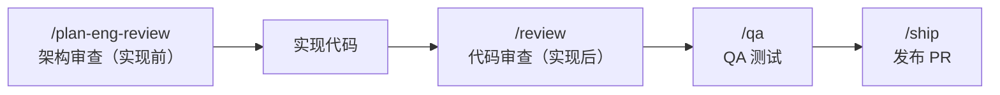

# `/review`

> **一句话定位：** PR 合并前的代码审查。分析当前分支与基础分支的 diff，发现 SQL 安全、LLM 信任边界、并发竞态、测试覆盖率等结构性问题，并直接修复——不只是报告。

---

## **概述**

`/review` 是 gstack 中代码质量的最后一道关卡，在 `/ship` 之前运行。

它不是"只读"审查器，而是**先修后报**（Fix-First）。能自动修复的直接修复，需要判断的才问你。

**触发时机：**

- 你说"review 这个 PR"、"code review"、"检查我的 diff"
- 准备 merge 或 land 代码时
- `/ship` 之前的必要步骤

**与 `/plan-eng-review` 的区别：**

| 技能               | 时机     | 对象                     |
| ------------------ | -------- | ------------------------ |
| `/plan-eng-review` | 实现之前 | 审查计划的架构与测试设计 |
| `/review`          | 实现之后 | 审查真实 diff 的代码质量 |

---

## **完整工作流程**

---

### **Step 0：检测平台与基础分支**

自动检测 Git 托管平台：

```bash
git remote get-url origin
```

- 包含 `github.com` → GitHub
- 包含 `gitlab` → GitLab
- 否则检测 `gh` / `glab` CLI

然后确定基础分支（PR 目标分支或默认分支），后续所有 `git diff` 均使用此分支。

---

### **Step 1：分支检查**

```bash
git branch --show-current
git fetch origin <base> --quiet
git diff origin/<base> --stat
```

- 如果在基础分支上 → 停止，输出"没有可审查的内容"
- 如果 diff 为空 → 同样停止

---

### **Step 1.5：范围漂移检测（Scope Drift）**

**在审查代码质量之前，先检查：他们构建的是被要求构建的东西吗？**

读取：

- `TODOS.md`
- PR 描述（`gh pr view`）
- 提交信息（`git log origin/..HEAD --oneline`）

如果没有 PR（常见情况，因为 `/review` 在 `/ship` 创建 PR 之前运行），依靠提交信息和 TODOS.md 推断意图。

#### 计划文件发现

优先从对话上下文中找计划文件路径；其次按内容搜索：

```bash
# 在 ~/.gstack/projects/$SLUG 等位置查找最近的 .md 文件
```

#### 计划完成度审计

从计划文件中提取所有可操作项（最多 50 条），与 diff 交叉比对，分类为：

- `DONE` — 有明确实现证据
- `PARTIAL` — 部分实现
- `NOT DONE` — diff 中无证据
- `CHANGED` — 用不同方式实现了相同目标

输出格式：

```
PLAN COMPLETION AUDIT
═══════════════════════════════
[DONE] Create UserService — src/services/user_service.rb
[PARTIAL] Add validation — model有但controller缺失
[NOT DONE] Add caching layer
COMPLETION: 4/7 DONE, 1 PARTIAL, 1 NOT DONE
```

#### 范围漂移输出

```
Scope Check: [CLEAN / DRIFT DETECTED / REQUIREMENTS MISSING]
Intent: <请求内容一行总结>
Delivered: <diff 实际做了什么>
Plan items: N DONE, M PARTIAL, K NOT DONE
```

这是**仅供参考**的信息，不阻塞审查流程。

---

### **Step 2：读取 Checklist**

读取 `.claude/skills/review/checklist.md`。

**如果文件无法读取，立即停止。** 没有 checklist 不继续。

---

### **Step 2.5：Greptile 审查评论检查**

读取 `greptile-triage.md`，获取并分类 Greptile 自动评论。

如果没有 PR 或没有 Greptile 评论，静默跳过。

分类：

- `VALID & ACTIONABLE`
- `VALID BUT ALREADY FIXED`
- `FALSE POSITIVE`
- `SUPPRESSED`

---

### **Step 3：获取 Diff**

```bash
git fetch origin <base> --quiet
git diff origin/<base>
```

获取完整 diff，包含已提交和未提交的改动。

---

### **Prior Learnings：加载历史学习**

```bash
~/.claude/skills/gstack/bin/gstack-learnings-search --limit 10
```

如果是首次运行，询问是否启用跨项目学习（数据不离开本机）。

当某条审查发现匹配历史学习时，显示：

> **"Prior learning applied: [key] (confidence N/10, from [date])"**

这让知识积累变得可见。

---

### **Step 4：双通道审查**

#### Pass 1（CRITICAL）

- SQL 与数据安全
- 竞态条件与并发
- LLM 输出信任边界
- Enum 与值完整性

**注意：** Enum 完整性需要读取 diff **之外**的代码。当 diff 引入新枚举值时，用 Grep 查找所有引用同级值的文件，检查新值是否被处理。

#### Pass 2（INFORMATIONAL）

- 条件性副作用
- 魔法数字与字符串耦合
- 死代码与一致性
- LLM Prompt 问题
- 测试覆盖率缺口
- 前端视图问题
- 性能与 Bundle 影响

#### 每条发现必须包含置信度

```
[SEVERITY] (confidence: N/10) file:line — 描述
```

| 置信度 | 含义                 | 处理方式           |
| ------ | -------------------- | ------------------ |
| 9–10   | 已验证，具体代码证明 | 正常展示           |
| 7–8    | 高置信度模式匹配     | 正常展示           |
| 5–6    | 中等，可能误报       | 展示并附注"请验证" |
| 3–4    | 低置信度，存疑       | 仅放入附录         |
| 1–2    | 推测                 | 仅 P0 级别才报告   |

---

### **Step 4.5：设计审查（条件性）**

检测 diff 是否涉及前端文件：

```bash
source <(~/.claude/skills/gstack/bin/gstack-diff-scope <base> 2>/dev/null)
```

- `SCOPE_FRONTEND=false` → 静默跳过
- `SCOPE_FRONTEND=true` → 执行以下步骤：

1. 读取 `DESIGN.md`（如果存在）作为设计规范基准
2. 读取 `design-checklist.md`
3. 读取每个改动的前端文件（完整文件，不只是 diff 块）
4. 应用设计 checklist，分类：
   - `[HIGH] 机械性 CSS 修复` → AUTO-FIX
   - `[HIGH/MEDIUM] 需要设计判断` → ASK
   - `[LOW] 意图检测` → INFORMATIONAL

可选：如果 Codex 可用，运行 7 项设计 Litmus 检查：

> 品牌是否在首屏清晰？有没有一个强视觉锚点？仅靠标题能否理解页面？每个区块只做一件事？卡片真的必要吗？动效是否提升了层次感？去掉装饰性阴影后还是否高质量？

---

### **Step 4.75：测试覆盖率图表**

这是 `/review` 中最重要的步骤之一，也是 `/plan-eng-review` 的实现阶段延续。

**目标：100% 覆盖率。** 所有新代码路径都必须有测试。

#### 第一步：追踪每条代码路径

读取每个改动文件的完整内容，从入口点（路由处理器、导出函数、事件监听器）开始，追踪数据流：

- 输入来自哪里？
- 什么在转换它？
- 它去向哪里？
- 每一步可能出什么问题？

#### 第二步：映射用户流程与交互状态

不只是代码覆盖，还要覆盖**真实用户行为**：

- 完整用户旅程（点击"支付" → 表单验证 → API 调用 → 成功/失败页面）
- 意外交互：双击提交、中途导航离开、会话过期后提交
- 错误状态：用户能看到什么？能恢复吗？
- 边界状态：零结果、10000 条结果、最大长度输入

#### 第三步：逐条检查现有测试

对每条路径，搜索是否有测试覆盖。

质量评分：

- ★★★ 覆盖行为 + 边界 + 错误路径
- ★★ 覆盖正常路径
- ★ 只有冒烟测试（"它渲染了"、"它不报错"）

#### E2E 决策矩阵

| 情况                 | 推荐      |
| -------------------- | --------- |
| 跨 3+ 组件的用户流程 | `[→E2E]`  |
| 认证/支付/数据销毁   | `[→E2E]`  |
| LLM Prompt 变更      | `[→EVAL]` |
| 纯函数、内部 helper  | 单元测试  |

#### 回归规则（强制）

**铁律：** 当覆盖率审计发现回归（之前正常但 diff 破坏了的代码），立即写回归测试。不问，不跳过。

#### 输出 ASCII 覆盖率图表

```
CODE PATH COVERAGE
===========================
[+] src/services/billing.ts
│
├── processPayment()
│   ├── [★★★ TESTED] 正常路径 + 卡被拒 + 超时 — billing.test.ts:42
│   ├── [GAP] 网络超时 — NO TEST
│   └── [GAP] 无效货币 — NO TEST
│
└── refundPayment()
    ├── [★★ TESTED] 全额退款 — billing.test.ts:89
    └── [★ TESTED] 部分退款（只检查不报错）— billing.test.ts:101

USER FLOW COVERAGE
===========================
[+] 支付结账流程
│
├── [★★★ TESTED] 完整购买 — checkout.e2e.ts:15
├── [GAP] [→E2E] 双击提交
└── [GAP] 支付中导航离开

─────────────────────────────────
COVERAGE: 5/13 paths (38%)
GAPS: 8 条路径需要测试（2 需要 E2E，1 需要 eval）
─────────────────────────────────
```

**覆盖率警告：** 如果低于阈值（默认 60%），在审查结果前显示：

```
⚠️ COVERAGE WARNING: AI 评估覆盖率 38%。13 条代码路径未测试。
建议在 /ship 之前补充测试。
```

---

### **Step 5：Fix-First 审查**

**每个发现都要有行动，不只是报告。**

输出头部：

```
Pre-Landing Review: N issues (X critical, Y informational)
```

#### Step 5a：分类

每条发现分为：

- `AUTO-FIX` — 直接修复
- `ASK` — 需要用户确认

Critical 倾向 ASK，Informational 倾向 AUTO-FIX。

#### Step 5b：自动修复

对每条 AUTO-FIX：

```
[AUTO-FIXED] [file:line] 问题 → 做了什么
```

#### Step 5c：批量询问 ASK 项

将所有 ASK 项合并为一个问题（3 条以下可以单独问）：

```
我自动修复了 5 个问题。2 个需要你的判断：

1. [CRITICAL] auth.ts:47 — 会话过期时 token 检查返回 undefined
   修复：在 checkToken() 中添加 null guard
   → A) 修复  B) 跳过

2. [INFORMATIONAL] api/users.ts:88 — LLM 输出未经类型检查直接写入 DB
   修复：添加 JSON schema 验证
   → A) 修复  B) 跳过

RECOMMENDATION: 两个都修复 — #1 是真实 bug，#2 防止静默数据损坏。
```

#### Step 5d：应用用户批准的修复

---

### **Step 5.5：TODOS 交叉引用**

读取 `TODOS.md`，检查：

- 这个 PR 是否关闭了某个 TODO？
- 这个 PR 是否产生了应该成为 TODO 的工作？
- 是否有相关 TODO 为某个发现提供了上下文？

---

### **Step 5.6：文档陈旧性检查**

对 repo 根目录的每个 `.md` 文件（README.md、ARCHITECTURE.md 等）：

- 如果代码变更影响了该文档描述的功能，但文档没有更新 → 标记为 INFORMATIONAL：

> "文档可能已过时：[file] 描述了 [feature]，但代码在此分支中已更改。考虑运行 `/document-release`。"

---

### **Step 5.7：对抗性审查（自动分级）**

根据 diff 大小自动选择深度：

| Diff 大小           | 行动                                                                                  |
| ------------------- | ------------------------------------------------------------------------------------- |
| < 50 行             | 跳过对抗性审查                                                                        |
| 50–199 行（Medium） | Codex 对抗性挑战（或 Claude 子代理）                                                  |
| 200+ 行（Large）    | 全部 4 个 Pass：Claude 结构审查 + Claude 对抗子代理 + Codex 结构审查 + Codex 对抗挑战 |

用户可以强制指定级别（"运行全部 pass"、"偏执审查"）。

#### Medium Tier

Codex 对抗挑战（5 分钟超时）：

> "像攻击者和混沌工程师一样思考。找出这段代码在生产中会失败的方式：边界条件、竞态、安全漏洞、资源泄漏、静默数据损坏。不要夸奖，只找问题。"

如果 Codex 不可用或报错，自动回退到 Claude 对抗子代理。

#### Large Tier

运行全部 4 个 Pass。如果 Codex 不可用：

> "Codex CLI 未找到 — 大 diff 审查运行了 Claude 结构审查 + Claude 对抗审查（4 个 pass 中的 2 个）。安装 Codex 以获得完整覆盖：`npm install -g @openai/codex`"

#### 跨模型综合

```
ADVERSARIAL REVIEW SYNTHESIS (auto: large, 347 lines):
════════════════════════════════════════════════════════════
  高置信度（多个来源发现）: [多个 pass 都同意的发现]
  仅 Claude 结构审查发现: ...
  仅 Claude 对抗子代理发现: ...
  仅 Codex 发现: ...
  使用的模型: Claude结构 ✓  Claude对抗 ✓  Codex ✓
════════════════════════════════════════════════════════════
```

多个来源都同意的发现，优先修复。

---

### **Step 5.8：持久化审查结果**

```bash
~/.claude/skills/gstack/bin/gstack-review-log '{
  "skill":"review",
  "timestamp":"...",
  "status":"clean|issues_found",
  "issues_found": N,
  "critical": N,
  "informational": N,
  "commit":"abc1234"
}'
```

这条记录被 `/ship` 读取，用于判断是否已完成代码审查。

---

### **Capture Learnings：记录学习**

如果发现了非显而易见的模式、陷阱或架构洞察：

```bash
~/.claude/skills/gstack/bin/gstack-learnings-log '{
  "skill":"review",
  "type":"pitfall",
  "key":"auth-token-null-guard",
  "insight":"...",
  "confidence": 9,
  "source":"observed",
  "files":["src/auth.ts"]
}'
```

只记录真正有价值的发现。"这个函数返回字符串"不算。"这个框架版本的 API 在 X 情况下静默失败"才算。

---

## **核心规则**

1. **先读完整个 diff，再评论。** 不要标记 diff 中已修复的问题。
2. **Fix-First，不是只读。** AUTO-FIX 直接应用，ASK 需要用户确认。永不提交、推送或创建 PR，那是 `/ship` 的工作。
3. **简洁。** 一行问题，一行修复。不要前言。
4. **只标记真实问题。** 没问题的跳过。
5. **用 Greptile 回复模板。** 每条回复都要有证据，不发模糊回复。

---

## **与其他技能的关系**



---

## **一句话总结**

`/review` 是"合并之前最后一个说不的机会"。

它不只是看，它动手修。

它不只是报告，它记录，学习，下次更准。

## 源码目录

gstack 仓库内技能实现目录：[`review/`](https://github.com/garrytan/gstack/tree/main/review)
