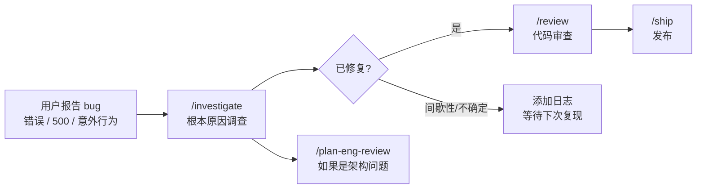

# `/investigate`

> **一句话定位：** 系统性调试，找到根本原因再修复。四个阶段：调查 → 分析 → 假设验证 → 实现。铁律：没有根本原因，不写任何修复。

---

## **概述**

`/investigate` 是 gstack 的调试引擎。

它解决的不是"怎么修"，而是"为什么坏"。

大多数调试失败是因为跳过了根本原因分析，直接猜测修复方案。结果：打地鼠。每修一个 bug，冒出两个新的。

`/investigate` 强制执行一个铁律：

> **没有根本原因，不写任何修复。**

**触发时机：**

- 你说"debug 这个"、"修这个 bug"、"为什么坏了"
- 报告错误、500、stack trace、意外行为
- "昨天还好好的"
- 排查某个功能为什么停止工作

**主动触发：** 当你描述任何错误或异常行为时，gstack 会主动调用 `/investigate`，而不是直接帮你猜测修复。

---

## **铁律**

```
NO FIXES WITHOUT ROOT CAUSE INVESTIGATION FIRST.
```

修复症状 = 打地鼠调试。

每一个不针对根本原因的修复，都让下一个 bug 更难找。

---

## **完整工作流程**

---

### **Phase 1：根本原因调查**

在形成任何假设之前，先收集上下文。

#### 1. 收集症状

读取错误信息、stack trace、复现步骤。

如果用户提供的上下文不足，每次只问一个问题（AskUserQuestion），不要一次抛出一堆问题。

#### 2. 读代码

从症状出发，向上追踪代码路径，找到潜在原因。

- 用 Grep 找所有引用
- 用 Read 理解逻辑
- 追踪数据流，而不是猜测

#### 3. 检查最近变更

```bash
git log --oneline -20 -- <相关文件>
```

关键问题：**这个功能之前正常吗？什么改变了？**

如果是回归，根本原因就在 diff 里。

#### 4. 复现

能否确定性地触发这个 bug？

如果不能，先收集更多证据，再继续。

---

### **Prior Learnings：加载历史学习**

```bash
~/.claude/skills/gstack/bin/gstack-learnings-search --limit 10
```

如果找到匹配的历史学习，显示：

> **"Prior learning applied: [key] (confidence N/10, from [date])"**

让知识积累变得可见。

---

### **Phase 1 输出**

```
Root cause hypothesis: [具体的、可验证的关于什么出错了以及为什么的断言]
```

这不是猜测，是基于证据的假设。

---

### **Scope Lock：范围锁定**

形成假设后，立即锁定编辑范围，防止调试过程中的范围蔓延。

```bash
[ -x "${CLAUDE_SKILL_DIR}/../freeze/bin/check-freeze.sh" ] && echo "FREEZE_AVAILABLE"
```

如果 freeze 可用，将受影响的最小目录写入 freeze 状态文件：

```bash
echo "<受影响目录>" > "$STATE_DIR/freeze-dir.txt"
```

告知用户：

> "调试范围已锁定到 `<目录>`。这防止对无关代码的改动。运行 `/unfreeze` 解除限制。"

如果 bug 跨越整个 repo 或范围不明确，跳过锁定并说明原因。

---

### **Phase 2：模式分析**

检查这个 bug 是否匹配已知模式：

| 模式          | 特征                        | 查找位置                         |
| ------------- | --------------------------- | -------------------------------- |
| 竞态条件      | 间歇性、依赖时序            | 共享状态的并发访问               |
| Nil/Null 传播 | NoMethodError、TypeError    | 可选值上缺少 guard               |
| 状态损坏      | 数据不一致、部分更新        | 事务、回调、钩子                 |
| 集成失败      | 超时、意外响应              | 外部 API 调用、服务边界          |
| 配置漂移      | 本地正常、staging/prod 失败 | 环境变量、feature flags、DB 状态 |
| 缓存过期      | 显示旧数据、清缓存后恢复    | Redis、CDN、浏览器缓存、Turbo    |

同时检查：

- `TODOS.md` 中是否有相关已知问题
- `git log` 查看同一区域的历史修复，**同一文件反复出现 bug 是架构问题的气味，不是巧合**

#### 外部模式搜索

如果 bug 不匹配已知模式，使用 WebSearch：

- `"{框架} {通用错误类型}"`
- `"{库} {组件} known issues"`

**搜索前必须脱敏：** 去掉主机名、IP、文件路径、SQL 片段、客户数据。搜索错误类别，不搜索原始错误信息。

---

### **Phase 3：假设验证**

**在写任何修复之前，先验证假设。**

#### 1. 确认假设

在疑似根本原因处添加临时日志、断言或调试输出。

运行复现步骤。证据是否匹配？

#### 2. 假设错误时

先考虑搜索这个错误（脱敏后）。

然后回到 Phase 1，收集更多证据。

**不要猜测。**

#### 3. 三次失败规则

如果 3 个假设都失败，**停止**。使用 AskUserQuestion：

```
3 个假设均已验证，均不匹配。这可能是架构问题而不是简单 bug。

A) 继续调查 — 我有新假设：[描述]
B) 上报人工审查 — 这需要了解系统的人来看
C) 添加日志等待 — 在该区域插桩，下次捕获
```

#### 红旗警告

看到以下情况，立即减速：

- **"先临时修一下"** — 没有"临时"。要么修对，要么上报。
- **没有追踪数据流就提出修复** — 这是在猜。
- **每次修复都暴露新问题** — 层次错了，不是代码错了。

---

### **Phase 4：实现**

根本原因确认后才开始实现。

#### 1. 修根本原因，不修症状

最小改动，消除实际问题。

#### 2. 最小 diff

- 触碰最少的文件
- 改动最少的行
- 抵制顺手重构周边代码的冲动

#### 3. 写回归测试

回归测试必须：

- **不加修复时失败**（证明测试有意义）
- **加修复后通过**（证明修复有效）

#### 4. 运行完整测试套件

粘贴输出。不允许引入新的回归。

#### 5. 大范围修复警告

如果修复触碰超过 5 个文件，使用 AskUserQuestion：

```
这个修复触碰了 N 个文件。对于一个 bug 修复来说，这是很大的影响范围。

A) 继续 — 根本原因确实跨越这些文件
B) 拆分 — 先修关键路径，其余推后
C) 重新思考 — 也许有更精准的方法
```

---

### **Phase 5：验证与报告**

**新鲜验证：** 复现原始 bug 场景，确认已修复。这不是可选项。

运行测试套件，粘贴输出。

输出结构化调试报告：

```
DEBUG REPORT
════════════════════════════════════════
Symptom:   [用户观察到的现象]
Root cause: [实际出错的原因]
Fix:        [改了什么，附 file:line 引用]
Evidence:   [测试输出，复现尝试证明修复有效]
Regression test: [新测试的 file:line]
Related:    [TODOS.md 条目、同区域历史 bug、架构注记]
Status:     DONE | DONE_WITH_CONCERNS | BLOCKED
════════════════════════════════════════
```

---

### **Capture Learnings：记录学习**

如果发现了非显而易见的模式、陷阱或架构洞察：

```bash
~/.claude/skills/gstack/bin/gstack-learnings-log '{
  "skill":"investigate",
  "type":"pitfall",
  "key":"auth-null-session",
  "insight":"会话过期时 token 检查返回 undefined 而非抛出异常",
  "confidence": 9,
  "source":"observed",
  "files":["src/auth.ts"]
}'
```

只记录真正有价值的发现。下次遇到类似问题时能节省时间的，才值得记录。

---

## **核心规则**

- **3 次失败假设 → 停止，质疑架构。** 是架构错了，不是假设不够多。
- **永不应用无法验证的修复。** 如果无法复现和确认，不要发布。
- **永不说"这应该能修好"。** 验证并证明它。运行测试。
- **修复触碰 > 5 个文件 → AskUserQuestion** 确认影响范围后再继续。

---

## **完成状态**

- **DONE** — 根本原因已找到，修复已应用，回归测试已写，所有测试通过
- **DONE_WITH_CONCERNS** — 已修复，但无法完全验证（如间歇性 bug，需要 staging 环境）
- **BLOCKED** — 调查后根本原因仍不明确，已上报

---

## **与其他技能的关系**



---

## **一句话总结**

`/investigate` 的哲学只有一句话：

**症状是谎言，根本原因才是真相。**

找到真相，再动手。

## 源码目录

gstack 仓库内技能实现目录：[`investigate/`](https://github.com/garrytan/gstack/tree/main/investigate)
