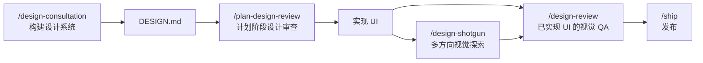

# `/design-review`

> **一句话定位：** 设计师视角的 QA，针对已上线或本地运行的真实站点。发现视觉不一致、间距问题、层次混乱、AI 垃圾模式、交互迟钝，然后直接修复，每个修复独立提交，并附上修复前后截图对比。

---

## **概述**

`/design-review` 是 gstack 设计工具链的最后一公里，作用于**已实现的 UI**。

与 `/plan-design-review`（审查计划）和 `/design-consultation`（构建设计系统）不同，这个技能的输入是**真实渲染的网页**，输出是**已提交的修复代码**。

它不是"提出建议"，而是"发现问题，生成截图证据，直接改代码，提交，验证"。

**触发时机：**

- 你说"审查设计"、"视觉 QA"、"看起来好不好"、"设计打磨"
- 提到视觉不一致或想要视觉层面的改进
- 准备发布前的设计最终检查

---

## **版本说明**

当前版本 v2.0.0，是 gstack 中最重的技能之一。包含 11 个 Phase、10 个审查维度、约 80 个检查项、AI 垃圾黑名单、双评分系统，以及完整的修复循环。

---

## **参数解析**

| 参数     | 默认值         | 覆盖示例                                     |
| -------- | -------------- | -------------------------------------------- |
| 目标 URL | 自动检测或询问 | `https://myapp.com`、`http://localhost:3000` |
| 范围     | 完整站点       | "只看设置页"、"只看首页"                     |
| 深度     | 标准（5–8 页） | `--quick`（首页+2页）、`--deep`（10–15页）   |
| 认证     | 无             | "以 user@example.com 登录"、"导入 cookies"   |

---

## **前置检查**

### 1. 没有给 URL 时的处理

- 在功能分支上 → 自动进入 **diff-aware 模式**（只审查分支变更影响的页面）
- 在 main/master 上 → 询问 URL

### 2. CDP 模式检测

```bash
$B status 2>/dev/null | grep -q "Mode: cdp" && echo "CDP_MODE=true"
```

如果是 CDP 模式（连接到用户真实浏览器），跳过 cookie 导入步骤，浏览器已有认证状态。

### 3. 读取 DESIGN.md

如果存在 `DESIGN.md`，读取它。所有设计发现都要对照设计系统校准，偏离设计系统的问题严重性更高。如果不存在，使用通用设计原则，并在 Phase 2 结束后提议从推断结果创建一个。

### 4. 工作树必须干净

```bash
git status --porcelain
```

如果有未提交的改动，**立即停止**，询问：

```
你的工作树有未提交的改动。/design-review 需要干净的工作树，
这样每个设计修复才能有独立的原子提交。

A) 提交我的改动（推荐）
B) Stash 我的改动
C) 中止
```

### 5. 检测 browse 和 design 二进制

- `$B`（browse）— 用于截图、快照、JS 注入、性能测量，**必需**
- `$D`（design generator）— 用于生成目标 mockup，可选增强

---

## **运行模式**

| 模式         | 触发条件                                     | 范围                          |
| ------------ | -------------------------------------------- | ----------------------------- |
| Full（默认） | 给定 URL                                     | 5–8 页，完整 checklist        |
| Quick        | `--quick`                                    | 首页 + 2 页，快速评分         |
| Deep         | `--deep`                                     | 10–15 页，完整 + 所有交互流程 |
| Diff-aware   | 功能分支 + 无 URL                            | 只审查分支变更影响的页面      |
| Regression   | `--regression` 或找到 `design-baseline.json` | 与上次基准对比，输出回归表    |

---

## **Phase 1：第一印象**

这是最像真正设计师的输出。在分析任何细节之前，先形成直觉反应。

```bash
$B goto <URL>
$B screenshot "$REPORT_DIR/screenshots/first-impression.png"
```

输出格式固定：

```
"这个站点传达的是 [什么]。"（一眼看上去说了什么）
"我注意到 [观察]。"（什么最突出，正面或负面，要具体）
"我的视线依次落在：[1]、[2]、[3]。"（层次检查）
"如果用一个词形容：[词]。"（直觉判断）
```

设计师不打圆场，要有观点。

---

## **Phase 2：设计系统提取**

提取站点**实际渲染**的设计系统（不是 DESIGN.md 说的，是浏览器里真实存在的）：

```javascript
// 字体（前500个元素）
[...new Set([...document.querySelectorAll('*')].slice(0,500)
  .map(e => getComputedStyle(e).fontFamily))]

// 颜色
[...new Set([...document.querySelectorAll('*')].slice(0,500)
  .flatMap(e => [getComputedStyle(e).color, getComputedStyle(e).backgroundColor])
  .filter(c => c !== 'rgba(0, 0, 0, 0)'))]

// 标题层级
[...document.querySelectorAll('h1,h2,h3,h4,h5,h6')]
  .map(h => ({tag, text, size, weight}))

// 触摸目标审查（找出 <44px 的可交互元素）
[...document.querySelectorAll('a,button,input,[role=button]')]
  .filter(e => rect.width < 44 || rect.height < 44)
```

整理为**推断设计系统**：

- **字体：** 列出使用的字体及频率。超过 3 种不同字体族时标记。
- **颜色：** 提取调色板。超过 12 种非灰色时标记。
- **标题比例：** h1–h6 的尺寸。标记跳级（h1 直接到 h3）。
- **间距模式：** 抽样 padding/margin 值，标记非倍数值。

Phase 2 结束后，提议：

> "要把这些观察保存为你的 DESIGN.md 吗？"

---

## **Phase 3：逐页视觉审查**

对范围内的每个页面：

```bash
$B goto <URL>
$B snapshot -i -a -o "$REPORT_DIR/screenshots/{page}-annotated.png"
$B responsive "$REPORT_DIR/screenshots/{page}"
$B console --errors
$B perf
```

### 认证检测

如果导航后 URL 跳转到 `/login`、`/signin`、`/auth`，询问是否需要导入 cookies。

---

### 设计审查 Checklist（10 个维度，约 80 项）

每条发现标注影响等级：high / medium / polish。

#### 1. 视觉层次与构图（8 项）

- 是否有清晰的焦点？每个视图只有一个主要 CTA？
- 视线是否自然地从左上流向右下？
- 视觉噪音，多个元素相互争夺注意力？
- 信息密度是否适合内容类型？
- Z-index 是否清晰，没有意外重叠？
- 首屏内容是否在 3 秒内传达了目的？
- 眯眼测试：模糊后层次是否仍然可见？
- 留白是有意为之，而不是剩余空间？

#### 2. 字体排版（15 项）

- 字体种数 ≤ 3
- 比例遵循模块化比例（1.25 或 1.333）
- 行高：正文 1.5x，标题 1.15–1.25x
- 行宽：每行 45–75 个字符（66 最佳）
- 标题层级不跳级
- 使用至少 2 种字重制造层次
- 未使用黑名单字体（Papyrus、Comic Sans、Lobster、Impact）
- 主字体是 Inter/Roboto/Open Sans/Poppins → 标记为可能过于通用
- 标题使用 `text-wrap: balance` 或 `text-pretty`
- 使用弯引号，不用直引号
- 使用省略号字符（`…`），不用三个点（`...`）
- 数字列使用 `font-variant-numeric: tabular-nums`
- 正文 ≥ 16px
- 说明/标签 ≥ 12px
- 小写字母不加字间距

#### 3. 颜色与对比度（10 项）

- 调色板一致（≤ 12 种非灰色）
- WCAG AA：正文 4.5:1，大文字（18px+）3:1，UI 组件 3:1
- 语义颜色一致（成功=绿、错误=红、警告=黄/琥珀）
- 不仅靠颜色编码（总是加标签、图标或图案）
- 深色模式：表面用层次感，不只是亮度反转
- 深色模式：文字用近白色（~#E0E0E0），不用纯白
- 深色模式中主色调降低 10–20% 饱和度
- 深色模式存在时，html 元素有 `color-scheme: dark`
- 没有纯红/纯绿组合（8% 男性有红绿色盲）
- 中性色调一致（全暖或全冷，不混用）

#### 4. 间距与布局（12 项）

- 网格在所有断点一致
- 间距使用比例尺（4px 或 8px 基础单位），不用随意数值
- 对齐一致，没有元素漂浮在网格之外
- 节奏感：相关元素靠近，不同区块分开
- 圆角层次感（不是所有元素统一大圆角）
- 内圆角 = 外圆角 - 间隙（嵌套元素）
- 移动端无横向滚动
- 设置了内容最大宽度（正文不全宽）
- 使用 `env(safe-area-inset-*)` 适配刘海屏
- URL 反映状态（过滤器、标签页、分页在查询参数中）
- 使用 flex/grid 布局（不用 JS 测量）
- 断点：移动（375）、平板（768）、桌面（1024）、宽屏（1440）

#### 5. 交互状态（10 项）

- 所有可交互元素有 hover 状态
- `focus-visible` 环存在（不能只有 `outline: none`）
- 按下状态有深度效果或颜色变化
- 禁用状态：降低透明度 + `cursor: not-allowed`
- 加载状态：骨架屏形状匹配真实内容布局
- 空状态：温暖的提示 + 主要操作 + 视觉元素（不只是"暂无数据"）
- 错误信息：具体 + 包含修复/下一步
- 成功：确认动画或颜色变化，自动消失
- 所有可交互元素触摸目标 ≥ 44px
- 所有可点击元素有 `cursor: pointer`

#### 6. 响应式设计（8 项）

- 移动端布局在设计上有意义（不只是桌面列的堆叠）
- 移动端触摸目标足够（≥ 44px）
- 任何视口都无横向滚动
- 图片响应式处理
- 移动端文字无需缩放即可阅读（正文 ≥ 16px）
- 导航在移动端适当折叠
- 表单在移动端可用（正确的 input type，移动端不 autoFocus）
- viewport meta 中没有 `user-scalable=no` 或 `maximum-scale=1`

#### 7. 动效与动画（6 项）

- 缓动：进入 ease-out，退出 ease-in，移动 ease-in-out
- 时长：50–700ms（页面过渡除外）
- 每个动画都传达某种信息（状态变化、注意力、空间关系）
- 遵守 `prefers-reduced-motion`
- 不用 `transition: all`，明确列出属性
- 只对 `transform` 和 `opacity` 做动画（不对 width、height、top、left）

#### 8. 内容与微文案（8 项）

- 空状态有温度（提示 + 操作 + 插画/图标）
- 错误信息具体：发生了什么 + 为什么 + 下一步怎么做
- 按钮标签具体（"保存 API Key"，不是"继续"或"提交"）
- 生产环境无占位符/Lorem Ipsum 文字
- 截断处理（`text-overflow: ellipsis`、`line-clamp`、`break-words`）
- 主动语态（"安装 CLI"，不是"CLI 将被安装"）
- 加载状态结尾用 `…`（"保存中…"，不是"保存中..."）
- 破坏性操作有确认弹窗或撤销窗口

#### 9. AI 垃圾检测（10 项黑名单）

**判断标准：一个受人尊敬的设计工作室的设计师会发布这个吗？**

1. **紫色/紫罗兰/靛蓝渐变背景**，或蓝到紫的配色方案
2. **三列功能网格：** 彩色圆圈图标 + 粗体标题 + 两行描述，3 个对称排列。这是最容易识别的 AI 布局。
3. 彩色圆圈图标作为区块装饰（SaaS 模板外观）
4. **全部居中**（所有标题、描述、卡片都 `text-align: center`）
5. **统一大圆角**（所有元素相同的大圆角）
6. 装饰性 blob、浮动圆圈、波浪形 SVG 分隔线（区块感觉空洞，需要更好的内容，不是装饰）
7. Emoji 作为设计元素（标题里的火箭，Emoji 作为列表符号）
8. 卡片左侧彩色边框（`border-left: 3px solid <color>`）
9. 通用 Hero 文案（"欢迎来到 [X]"、"解锁…的力量"、"您的一站式解决方案"）
10. **千篇一律的区块节奏**（Hero → 3 功能 → 推荐语 → 定价 → CTA，每个区块相同高度）

#### 10. 性能即设计（6 项）

- LCP < 2.0s（Web app），< 1.5s（信息站点）
- CLS < 0.1（加载时无可见布局偏移）
- 骨架屏质量：形状匹配真实内容布局，有闪光动画
- 图片：`loading="lazy"`，设置宽高，WebP/AVIF 格式
- 字体：`font-display: swap`，预连接到 CDN 源
- 无可见字体闪烁（FOUT）——关键字体已预加载

---

## **Phase 4：交互流程审查**

走 2–3 个关键用户流程，评估**感觉**，不只是功能：

```bash
$B snapshot -i
$B click @e3
$B snapshot -D  # 查看 diff
```

评估：

- **响应感：** 点击感觉灵敏吗？有延迟或缺失的加载状态吗？
- **过渡质量：** 过渡是有意为之还是通用/缺失？
- **反馈清晰度：** 操作是否清晰地成功或失败？反馈是否即时？
- **表单打磨：** 焦点状态是否可见？验证时机是否正确？错误是否在源头附近？

---

## **Phase 5：跨页一致性**

对比多页截图和观察结果：

- 导航栏在所有页面一致？
- 页脚一致？
- 组件复用 vs 一次性设计（同一个按钮在不同页面样式不同？）
- 语调一致（一页活泼，另一页企业风？）
- 间距节奏在各页面延续？

---

## **Phase 6：编写报告**

### 输出位置

```
~/.gstack/projects/$SLUG/designs/design-audit-{YYYYMMDD}/
├── design-audit-{domain}.md
├── screenshots/
│   ├── first-impression.png
│   ├── {page}-annotated.png
│   ├── {page}-mobile.png
│   ├── {page}-tablet.png
│   ├── {page}-desktop.png
│   ├── finding-001-before.png
│   ├── finding-001-target.png   ← 如果生成了目标 mockup
│   ├── finding-001-after.png
│   └── ...
└── design-baseline.json         ← 用于 regression 模式
```

### 双评分系统

**设计评分：{A–F}** — 10 个维度的加权平均

**AI 垃圾评分：{A–F}** — 独立评分，附简短判断语

**评分标准：**

| 等级 | 含义                                     |
| ---- | ---------------------------------------- |
| A    | 有意图、精致、令人愉悦。体现了设计思维。 |
| B    | 基础扎实，小的不一致。看起来专业。       |
| C    | 可用但通用。没有大问题，没有设计观点。   |
| D    | 明显的问题。感觉未完成或粗心。           |
| F    | 正在伤害用户体验。需要大幅返工。         |

**评分计算：** 每个维度从 A 开始。每个 High 影响发现降一个字母等级，Medium 降半个等级，Polish 仅记录不影响评分。

**维度权重：**

| 维度     | 权重 |
| -------- | ---- |
| 视觉层次 | 15%  |
| 字体排版 | 15%  |
| 间距布局 | 15%  |
| 颜色对比 | 10%  |
| 交互状态 | 10%  |
| 响应式   | 10%  |
| 内容质量 | 10%  |
| AI 垃圾  | 5%   |
| 动效     | 5%   |
| 性能感受 | 5%   |

---

## **Design Outside Voices（自动运行）**

如果 Codex 可用，自动并行运行：

**Codex 设计声音** — 从源码审查：

- 间距是否系统化？
- 字体是否有表达力？
- 颜色是否有 CSS 变量系统？
- 响应式断点是否定义？
- 无障碍：ARIA、alt 文字、对比度、44px 触摸目标？
- 动效：2–3 个有意图的动画，还是零个或纯装饰？
- 卡片：只在卡片是交互本身时使用？

**Claude 子代理** — 关注**一致性模式**而非单点违规：

- 间距值在代码库中是否系统化？
- 是否有统一的颜色系统？
- 响应式断点是否一致？

输出 Litmus 评分卡，合并到 Phase 7 的分类中，标注来源 `[codex]` / `[subagent]` / `[cross-model]`。

---

## **Phase 7：分类**

按影响排序所有发现：

- **High Impact** — 先修。影响第一印象，损害用户信任。
- **Medium Impact** — 次修。降低打磨感，潜意识能感受到。
- **Polish** — 时间允许再修。区分好与卓越的差距。

无法从源码修复的（第三方组件、需要团队提供文案）→ 标记为"延期"。

---

## **Phase 8：修复循环**

对每个可修复的发现，按影响顺序：

### 8a. 定位源码

只修改直接导致设计问题的文件。优先 CSS/样式改动，而非结构性组件改动。

### 8a.5. 目标 Mockup（如果 DESIGN_READY）

对于涉及视觉布局、层次或间距的发现（不只是颜色值或字号这类简单 CSS 修复），生成目标 mockup：

```bash
$D generate --brief "<应该是什么样子>" --output "$REPORT_DIR/screenshots/finding-NNN-target.png"
```

展示给用户：

> "这是当前状态（截图），这是应该的样子（mockup）。现在我来修改源码使其匹配。"

### 8b. 修复

最小改动，只解决设计问题。不重构周边代码，不添加功能，不"顺手改进"无关内容。

### 8c. 提交

```bash
git add <文件>
git commit -m "style(design): FINDING-NNN — 简短描述"
```

**每个修复一个提交，永不打包。**

### 8d. 重新测试

```bash
$B goto <URL>
$B screenshot "$REPORT_DIR/screenshots/finding-NNN-after.png"
$B console --errors
$B snapshot -D
```

每个修复都要有**修复前后截图对**。

### 8e. 分类修复结果

- **verified** — 重测确认修复有效，无新错误
- **best-effort** — 已修复但无法完全验证（需要特定浏览器状态）
- **reverted** — 检测到回归 → `git revert HEAD` → 标记为"延期"

### 8f. 自我调节（每 5 个修复后评估）

```
DESIGN-FIX RISK:
从 0% 开始
每次 revert：+15%
每个 CSS-only 文件改动：+0%（安全）
每个 JSX/TSX/组件文件改动：+5%
第 10 个修复后：每额外修复 +1%
触碰无关文件：+20%
```

**风险 > 20%：立即停止**，展示已完成内容，询问是否继续。

**硬上限：30 个修复。** 超过后无论剩余发现多少，停止。

---

## **Phase 9：最终设计审查**

所有修复应用后：

1. 对所有受影响的页面重新运行设计审查
2. 如果生成了目标 mockup，运行对比验证
3. 计算最终设计评分和 AI 垃圾评分
4. **如果最终评分比基准更差：显著警告** — 某些东西回归了

---

## **Phase 10：报告**

每条发现额外包含：

- 修复状态：verified / best-effort / reverted / deferred
- 提交 SHA（如果已修复）
- 改动的文件（如果已修复）
- 修复前后截图

总结部分：

- 总发现数
- 已应用修复（verified: X，best-effort: Y，reverted: Z）
- 延期发现
- 设计评分变化：基准 → 最终
- AI 垃圾评分变化：基准 → 最终

PR 一行摘要：

> "设计审查发现 N 个问题，修复了 M 个。设计评分 X → Y，AI 垃圾评分 X → Y。"

---

## **Phase 11：更新 TODOS.md**

如果 repo 有 `TODOS.md`：

- 新的延期设计发现 → 添加为 TODO，附影响等级和描述
- 已修复的发现如果之前在 TODOS.md 中 → 注明"由 /design-review 修复于 {branch}，{date}"

---

## **核心规则**

1. **像设计师思考，不像 QA 工程师。** 你关心的是感觉是否对、是否有意图、是否尊重用户，而不只是"能不能用"。
2. **截图是证据。** 每个发现至少一张截图。
3. **具体且可操作。** "把 X 改成 Y，因为 Z"，不是"间距感觉不对"。
4. **不读源码进行评估。** 评估渲染后的站点，不是实现。（例外：提议从观察结果写 DESIGN.md。）
5. **AI 垃圾检测是你的超能力。** 大多数开发者无法判断自己的站点是否看起来像 AI 生成的。你可以。直接说。
6. **快速赢得很重要。** 总是包含"快速修复"部分，3–5 个每个 < 30 分钟的高影响修复。
7. **响应式是设计，不只是"没坏"。** 移动端堆叠的桌面布局不是响应式设计，那是懒惰。
8. **CSS 优先。** 优先 CSS/样式改动，而非结构性组件改动。更安全，更容易撤销。

---

## **与其他技能的关系**



---

## **一句话总结**

`/design-review` 做的是设计师在发布前会做的事：

打开浏览器，截图，皱眉，然后动手修。

不是报告问题，是消灭问题。

## 源码目录

gstack 仓库内技能实现目录：[`design-review/`](https://github.com/garrytan/gstack/tree/main/design-review)
