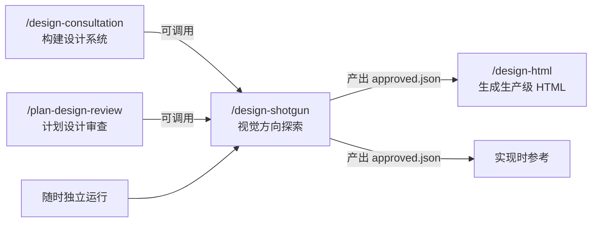

# `/design-shotgun`

> **一句话定位：** 视觉设计探索工具。并行生成多个 AI 设计变体，在浏览器中并排展示，收集结构化反馈，循环迭代直到你满意一个方向。随时可以运行，不依赖任何特定阶段。

---

## **概述**

`/design-shotgun` 是 gstack 设计工具链中最自由的一个技能。

它不审查，不构建设计系统，不修复 bug。它做的只有一件事：**让你看到你的产品可以长什么样**，然后帮你选出一个方向。

名字里的"shotgun"很贴切——一次发射多颗子弹，看哪颗打中目标。

**触发时机：**

- 你说"探索设计"、"给我看几个选项"、"设计变体"、"视觉头脑风暴"
- "我不喜欢这个看起来的样子"
- 你描述了一个 UI 功能，但还没看过它可能长什么样
- 任何时候，只要你想在实现之前或实现过程中看到视觉方向

**与其他技能的差异：**

| 技能                   | 时机       | 目的                |
| ---------------------- | ---------- | ------------------- |
| `/design-consultation` | 项目初期   | 从零构建设计系统    |
| `/design-shotgun`      | 任何时候   | 视觉方向探索与选择  |
| `/design-html`         | 方向确定后 | 将设计转为可用 HTML |
| `/design-review`       | 实现之后   | 审查并修复已有 UI   |

---

## **完整工作流程**

---

### **Step 0：会话检测**

检查这个项目是否有之前的设计探索记录：

```bash
eval "$(~/.claude/skills/gstack/bin/gstack-slug 2>/dev/null)"
_PREV=$(find ~/.gstack/projects/$SLUG/designs/ -name "approved.json" -maxdepth 2 2>/dev/null | sort -r | head -5)
```

**如果有历史记录：** 读取每个 `approved.json`，展示摘要，然后询问：

```
之前的设计探索记录：
- [日期]: [屏幕] — 选择了变体 [X]，反馈：'[摘要]'

A) 重访 — 重新打开对比看板，调整你的选择
B) 新探索 — 用新的或更新的说明重新开始
C) 其他
```

**如果没有历史记录：** 展示首次使用说明：

> "这是 /design-shotgun，你的视觉头脑风暴工具。我会生成多个 AI 设计方向，在浏览器中并排展示，你选择你最喜欢的。你可以在开发的任何阶段运行 /design-shotgun，为产品的任何部分探索设计方向。我们开始吧。"

---

### **Step 1：上下文收集**

如果是从 `/plan-design-review`、`/design-consultation` 或其他技能调用过来的，上下文已经准备好了，检查 `$_DESIGN_BRIEF` 是否已设置，如果是则直接跳到 Step 2。

独立运行时，需要收集 5 个维度的上下文：

1. **Who** — 设计面向谁？（用户画像、受众、专业水平）
2. **Job to be done** — 用户在这个页面/屏幕上要完成什么任务？
3. **已有什么** — 代码库里已有哪些组件、页面、设计模式？
4. **用户流程** — 用户如何到达这个屏幕，离开后去哪里？
5. **边缘情况** — 长名字、零结果、错误状态、移动端、首次用户 vs 老用户

**先自动收集：**

```bash
cat DESIGN.md 2>/dev/null | head -80
ls src/ app/ pages/ components/ 2>/dev/null | head -30
ls ~/.gstack/projects/$SLUG/*office-hours* 2>/dev/null | head -5
```

如果 `DESIGN.md` 存在，告知用户：

> "我会默认遵循你的 DESIGN.md 设计系统。如果你想在视觉方向上突破限制，直接说——design-shotgun 会跟着你走，但默认不会偏离。"

**检测本地站点**（"我不喜欢这个看起来的样子"的场景）：

```bash
curl -s -o /dev/null -w "%{http_code}" http://localhost:3000 2>/dev/null
```

如果本地站点正在运行且用户提到了 URL 或说"不喜欢这个样子"，截图当前页面，使用 `$D evolve`（从现有设计生成改进变体）而不是 `$D variants`（全新生成）。

**最多两轮上下文收集**，然后用已有信息继续，标注假设。不过度追问。

---

### **Step 2：品味记忆（Taste Memory）**

读取此项目之前所有批准的设计：

```bash
_TASTE=$(find ~/.gstack/projects/$SLUG/designs/ -name "approved.json" -maxdepth 2 2>/dev/null | sort -r | head -10)
```

如果有历史记录，提取批准变体的共同特征，加入生成 brief：

> "用户之前批准的设计具有这些特征：[高对比度、充足留白、现代无衬线字体等]。偏向这种美学，除非用户明确要求不同方向。"

这让每次探索都建立在已有品味判断之上，不用从零开始。

---

### **Step 3：生成变体**

创建输出目录：

```bash
eval "$(~/.claude/skills/gstack/bin/gstack-slug 2>/dev/null)"
_DESIGN_DIR=~/.gstack/projects/$SLUG/designs/<screen-name>-$(date +%Y%m%d)
mkdir -p "$_DESIGN_DIR"
```

所有设计产物**必须**保存到 `~/.gstack/projects/$SLUG/designs/`，永远不要保存到 `.context/`、`docs/designs/` 或 `/tmp/`。设计产物是用户数据，跨分支、跨会话、跨工作区持久存在。

---

#### **Step 3a：概念生成**

在任何 API 调用之前，先用文字描述每个变体的设计方向。每个概念应该是一个**不同的创意方向**，不是小幅变体。

```
我将探索 3 个方向：
A) "名字" — 这个方向的一行视觉描述
B) "名字" — 这个方向的一行视觉描述
C) "名字" — 这个方向的一行视觉描述
```

结合 DESIGN.md、品味记忆和用户请求，让每个概念真正不同。

---

#### **Step 3b：概念确认**

生成前先确认，避免浪费 API 额度：

```
这是我将生成的 {N} 个方向。每个大约需要 60 秒，
但我会并行运行，所以总时间约 60 秒，与数量无关。

A) 生成全部 {N} 个 — 看起来不错
B) 我想改一些概念（告诉我哪些）
C) 增加更多变体
D) 减少变体（告诉我删掉哪些）
```

如果 B/C/D：调整概念，重新展示，重新确认。最多 2 轮。

---

#### **Step 3c：并行生成**

**如果是"进化"路径**（用户说"不喜欢这个样子"），先截图：

```bash
$B screenshot "$_DESIGN_DIR/current.png"
```

**在单条消息中并行启动 N 个子代理**。每个子代理独立处理生成、质量检查、验证和重试。

`$D` 路径必须作为绝对路径注入每个子代理提示（子代理不继承 shell 变量）。

每个子代理的任务：

```
1. 运行：{$D 路径} generate --brief "{brief}" --output /tmp/variant-{letter}.png
2. 如果遇到限流错误（429），等待 5 秒重试，最多 3 次
3. 如果输出文件缺失或为空，重试一次
4. 复制：cp /tmp/variant-{letter}.png {_DESIGN_DIR}/variant-{letter}.png
5. 质量检查：{$D 路径} check --image {_DESIGN_DIR}/variant-{letter}.png --brief "{brief}"
   如果质量检查失败，重试一次生成
6. 验证：ls -lh {_DESIGN_DIR}/variant-{letter}.png
7. 报告结果之一：
   VARIANT_{letter}_DONE: {文件大小}
   VARIANT_{letter}_FAILED: {错误描述}
   VARIANT_{letter}_RATE_LIMITED: 重试耗尽
```

为什么先生成到 `/tmp/` 再复制？实测中 `$D generate --output ~/.gstack/...` 会因沙箱限制报"操作被中止"，而 `--output /tmp/...` 成功。这是已知行为，强制绕过。

---

#### **Step 3d：结果处理**

所有子代理完成后：

1. 用 Read 工具内联展示每个生成的 PNG，让用户立即在终端中看到全部变体
2. 报告状态："全部 {N} 个变体在约 {实际时间} 内生成完成。{成功数} 个成功，{失败数} 个失败。"
3. 任何失败都要明确报告，不静默跳过
4. 如果零个成功 → 回退到顺序生成（一次一个），告知用户"并行生成失败（可能是限流）。回退到顺序模式..."

构建对比看板的图片列表时，从实际存在的文件动态构建，不用硬编码 A/B/C：

```bash
_IMAGES=$(ls "$_DESIGN_DIR"/variant-*.png 2>/dev/null | tr '\n' ',' | sed 's/,$//')
```

---

### **Step 4：对比看板 + 反馈循环**

生成对比看板并启动 HTTP 服务：

```bash
$D compare --images "$_IMAGES" --output "$_DESIGN_DIR/design-board.html" --serve &
```

在后台运行（`&`），服务器需要持续运行以响应用户交互。从 stderr 解析端口号：`SERVE_STARTED: port=XXXXX`。

然后用 AskUserQuestion 等待用户，包含看板 URL：

> "我已打开一个包含设计变体的对比看板：
> http://127.0.0.1:\<port\>/ — 给它们打分，留下评论，混合你喜欢的元素，完成后点击提交。
> 告诉我你提交了反馈（或直接在这里粘贴你的偏好）。
> 如果你点击了重新生成或混合，告诉我，我会生成新的变体。"

**不要用 AskUserQuestion 直接问"你更喜欢哪个"。** 对比看板就是选择器，AskUserQuestion 只是阻塞等待机制。

---

#### **反馈检测**

用户响应后，检查反馈文件：

```bash
if [ -f "$_DESIGN_DIR/feedback.json" ]; then
  echo "SUBMIT_RECEIVED"
  cat "$_DESIGN_DIR/feedback.json"
elif [ -f "$_DESIGN_DIR/feedback-pending.json" ]; then
  echo "REGENERATE_RECEIVED"
  cat "$_DESIGN_DIR/feedback-pending.json"
  rm "$_DESIGN_DIR/feedback-pending.json"
else
  echo "NO_FEEDBACK_FILE"
fi
```

反馈 JSON 结构：

```json
{
  "preferred": "A",
  "ratings": { "A": 4, "B": 3, "C": 2 },
  "comments": { "A": "喜欢这个间距" },
  "overall": "用 A，但 CTA 要更大",
  "regenerated": false
}
```

**收到 `feedback.json`（用户点击了提交）：** 读取 `preferred`、`ratings`、`comments`、`overall`，进入 Step 5。

**收到 `feedback-pending.json`（用户点击了重新生成/混合）：**

1. 读取 `regenerateAction`（`"different"`、`"match"`、`"more_like_B"`、`"remix"` 或自定义文字）
2. 如果是 `"remix"`，读取 `remixSpec`（例如 `{"layout":"A","colors":"B"}`）
3. 用更新的 brief 生成新变体
4. 创建新看板，重载浏览器中的同一标签页：

```bash
curl -s -X POST http://127.0.0.1:<PORT>/api/reload \
  -H 'Content-Type: application/json' \
  -d '{"html":"$_DESIGN_DIR/design-board.html"}'
```

5. 再次 AskUserQuestion 等待下一轮反馈，直到收到 `feedback.json`

**`NO_FEEDBACK_FILE`（用户直接在文字框里回复）：** 将文字响应作为反馈使用。

**降级处理（`$D serve` 失败时）：** 用 Read 工具内联展示每个变体，然后 AskUserQuestion 直接询问偏好。

---

### **Step 5：反馈确认**

收到反馈后，输出清晰摘要确认理解：

```
这是我从你的反馈中理解的：
PREFERRED: 变体 [X]
RATINGS: A: 4/5, B: 3/5, C: 2/5
你的备注: [完整的每个变体和整体评论]
方向: [如果有重新生成操作]
这样理解对吗？
```

用 AskUserQuestion 确认后再保存。

---

### **Step 6：保存与后续步骤**

保存批准结果：

```bash
echo '{"approved_variant":"<X>","feedback":"<summary>","date":"...","screen":"<name>","branch":"..."}' \
  > "$_DESIGN_DIR/approved.json"
```

如果是从其他技能调用的，返回结构化反馈供调用技能消费（读取 `approved.json` 和批准的变体 PNG）。

如果是独立运行，提供后续步骤选项：

```
设计方向已确定。接下来做什么？

A) 继续迭代 — 用具体反馈精炼批准的变体
B) 最终确定 — 用 /design-html 生成生产级 Pretext 原生 HTML/CSS
C) 保存到计划 — 将此作为批准的 mockup 参考添加到当前计划
D) 完成 — 我稍后会用到这个
```

---

## **降级路径**

| 情况                   | 行为                                         |
| ---------------------- | -------------------------------------------- |
| `DESIGN_NOT_AVAILABLE` | 回退到 HTML 线框图方式（`DESIGN_SKETCH`）    |
| `BROWSE_NOT_AVAILABLE` | 用 `open file://...` 代替 `$B goto` 打开看板 |
| 并行生成全部失败       | 回退到顺序生成，逐个展示                     |
| `$D serve` 失败        | 内联展示变体，AskUserQuestion 直接收集偏好   |

---

## **核心规则**

1. **永不保存到 `.context/`、`docs/designs/` 或 `/tmp/`。** 所有设计产物保存到 `~/.gstack/projects/$SLUG/designs/`。
2. **打开看板前先内联展示变体。** 用户应立即在终端看到设计，浏览器看板用于详细反馈。
3. **保存前确认反馈。** 总是总结你的理解并验证。
4. **品味记忆是自动的。** 之前批准的设计默认影响新生成，无需配置。
5. **上下文收集最多两轮。** 不过度追问，带着假设继续。
6. **DESIGN.md 是默认约束。** 除非用户明确说要突破。

---

## **与其他技能的关系**



---

## **一句话总结**

`/design-shotgun` 解决的问题是：

**你脑子里有个模糊的方向，但不知道它实际长什么样。**

它把"也许可以这样"变成"就是这个"。

## 源码目录

gstack 仓库内技能实现目录：[`design-shotgun/`](https://github.com/garrytan/gstack/tree/main/design-shotgun)
