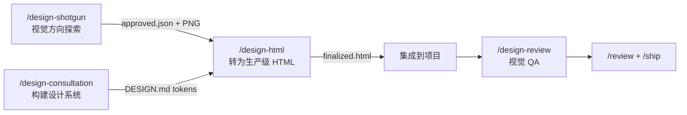

# `/design-html`

> **一句话定位：** 设计最终化引擎。将 `/design-shotgun` 批准的 AI mockup 转换为生产级 Pretext 原生 HTML/CSS。文字真正自动换行，高度根据内容计算，布局动态响应。30KB 开销，零依赖。

---

## **概述**

`/design-html` 是 gstack 设计工具链的终点。

它解决一个具体问题：AI 生成的 mockup 是静态图片，像素完美但不能用。`/design-html` 把它变成真正能运行的 HTML，用的是 **Pretext** 这个计算布局引擎，文字实际会换行，卡片实际会自适应内容高度，聊天气泡实际会收缩包裹文字。

不是 CSS 近似。是计算布局。

**触发时机：**

- 你说"最终化这个设计"、"把这个 mockup 转成 HTML"、"实现这个设计"
- `/design-shotgun` 批准了一个方向之后
- 你有一个 PNG 参考图，想要对应的 HTML

---

## **什么是 Pretext？**

Pretext 是一个 JavaScript 布局引擎，提供 CSS 无法做到的能力：

- 文字真正换行（不是固定高度容器）
- 高度根据内容计算（不是 `min-height` 猜测）
- 卡片自适应（不是 `flexbox` 近似）
- 聊天气泡收缩包裹（不是 `max-width` 妥协）
- 文字绕障碍物排版（编辑类布局）

开销：30KB，零依赖。

---

## **完整工作流程**

---

### **Step 0：输入检测**

```bash
eval "$(~/.claude/skills/gstack/bin/gstack-slug 2>/dev/null)"
```

**1. 查找最近的批准设计：**

```bash
ls -t ~/.gstack/projects/$SLUG/designs/*/approved.json 2>/dev/null | head -1
```

如果找到，读取：批准的变体 PNG 路径、用户反馈、屏幕名称。

**2. 读取 DESIGN.md：** 如果存在，这里的 token（字体、品牌颜色、间距比例）优先级最高，覆盖从 mockup 提取的值。

**3. 进化模式检测：**

```bash
ls -t ~/.gstack/projects/$SLUG/designs/*/finalized.html 2>/dev/null | head -1
```

如果找到之前的 `finalized.html`，询问：

```
找到了上次会话的最终化 HTML。要在它基础上进化
（在现有 HTML 上应用新改动，保留你的自定义编辑）
还是重新开始？

A) 进化 — 在现有 HTML 上迭代
B) 重新开始 — 从批准的 mockup 重新生成
```

**4. 没有 `approved.json` 时：**

```
没有找到批准的设计。你需要先有一个 mockup。

A) 运行 /design-shotgun — 探索设计变体并批准一个
B) 我有一个 PNG — 提供文件路径
```

---

### **Step 1：设计分析**

**如果 `$D` 可用：** 用视觉 AI 提取结构化实现规格：

```bash
$D prompt --image <approved-variant.png> --output json
```

返回颜色、字体、布局结构、组件清单。

**如果 `$D` 不可用：** 用 Read 工具内联读取批准的 PNG，自行描述视觉布局、颜色、字体和组件结构。

然后用 DESIGN.md token 覆盖系统级属性（品牌颜色、字体族、间距比例）。

输出**实现规格摘要**：颜色（hex）、字体（族 + 字重）、间距比例、组件列表、布局类型。

---

### **Step 2：智能 Pretext API 路由**

分析批准的设计，分类到对应的 Pretext 层级：

| 设计类型                     | Pretext API                                  | 适用场景                 |
| ---------------------------- | -------------------------------------------- | ------------------------ |
| 简单布局（Landing、营销页）  | `prepare()` + `layout()`                     | 可感知 resize 的高度     |
| 卡片/网格（Dashboard、列表） | `prepare()` + `layout()`                     | 自适应大小的卡片         |
| 聊天/消息 UI                 | `prepareWithSegments()` + `walkLineRanges()` | 紧密包裹的气泡、最小宽度 |
| 内容密集型（编辑类、博客）   | `prepareWithSegments()` + `layoutNextLine()` | 文字绕障碍物排版         |
| 复杂编辑布局                 | 完整引擎 + `layoutWithLines()`               | 手动行渲染               |

说明选择的层级和原因，引用具体将使用的 Pretext API。

---

### **Step 2.5：框架检测**

```bash
cat package.json | grep -o '"react"\|"svelte"\|"vue"\|"@angular/core"\|"solid-js"\|"preact"' | head -1
```

**如果检测到框架：**

```
检测到 [React/Svelte/Vue]。输出格式是什么？

A) 原生 HTML — 独立预览文件（推荐用于第一次）
B) [React/Svelte/Vue] 组件 — 框架原生，带 Pretext hooks
```

如果选 B，追问：TypeScript 还是 JavaScript？

**如果没有检测到框架：** 默认输出原生 HTML，不询问。

---

### **Step 3：生成 Pretext 原生 HTML**

#### Pretext 源码内嵌

**原生 HTML 输出：** 检查 vendored Pretext bundle：

```bash
_PRETEXT_VENDOR=~/.claude/skills/gstack/design-html/vendor/pretext.js
```

- 如果找到 → 读取文件，内联到 `<script>` 标签（添加注释：`<!-- pretext vX.X.X vendored -->`）
- 如果没找到 → 使用 CDN：`https://cdn.jsdelivr.net/npm/@chenglou/pretext@latest/dist/pretext.min.js`

**框架输出：** 安装到项目依赖：

```bash
# 自动检测包管理器
bun add @chenglou/pretext
# 或 pnpm add / yarn add / npm install
```

#### 输出文件位置

```
~/.gstack/projects/$SLUG/designs/<screen-name>-YYYYMMDD/finalized.html
# 框架输出：
~/.gstack/projects/$SLUG/designs/<screen-name>-YYYYMMDD/finalized.[tsx|svelte|vue]
```

#### 原生 HTML 必须包含

- Pretext 源码（内联或 CDN）
- CSS 自定义属性（来自 DESIGN.md / Step 1 提取的 design token）
- Google Fonts via `<link>` 标签 + `document.fonts.ready` 门控（在第一次 `prepare()` 之前等待字体加载）
- 语义化 HTML5（`<header>`、`<main>`、`<nav>`、`<section>`、`<article>`、`<footer>`）
- Pretext 初始化模式（见下方）
- `ResizeObserver` 触发重新布局
- 移动端 viewport meta 标签
- 浅色/深色模式 CSS 变量

---

### **Pretext 初始化模式**

根据 Step 2 选择的层级：

**简单/卡片布局：**

```javascript
import { prepare, layout } from "@chenglou/pretext";

async function init() {
  await document.fonts.ready;
  const root = document.getElementById("root");
  const prepared = prepare(root);
  layout(prepared);

  new ResizeObserver(() => layout(prepare(root))).observe(root);
}
init();
```

**聊天/消息 UI：**

```javascript
import { prepareWithSegments, walkLineRanges } from "@chenglou/pretext";

async function renderBubbles() {
  await document.fonts.ready;
  const container = document.getElementById("chat");
  const { segments } = prepareWithSegments(container);

  walkLineRanges(segments, (range, metrics) => {
    // 根据每行实际尺寸精确定位气泡
    range.element.style.width = `${metrics.width}px`;
  });
}
renderBubbles();
```

**编辑类/文字绕排：**

```javascript
import { prepareWithSegments, layoutNextLine } from "@chenglou/pretext";

async function layoutEditorial() {
  await document.fonts.ready;
  const article = document.getElementById("article");
  const { segments, obstacles } = prepareWithSegments(article);

  let cursor = { x: 0, y: 0 };
  for (const segment of segments) {
    cursor = layoutNextLine(segment, obstacles, cursor);
  }
}
layoutEditorial();
```

---

### **Step 4：视觉验证**

HTML 写入后，打开并截图验证：

```bash
$B goto "file://$_OUTPUT_FILE"
$B screenshot "$_DESIGN_DIR/finalized-screenshot.png"
```

用 Read 工具内联展示截图，让用户立即看到结果。

**对比检查：** 如果 `$D` 可用，运行视觉对比：

```bash
$D check --image "$_DESIGN_DIR/finalized-screenshot.png" \
         --brief "与批准的 mockup 匹配：$_APPROVED_PNG"
```

如果对比失败，识别差异并修复，最多 2 次迭代。

**响应式测试：**

```bash
$B responsive "$_DESIGN_DIR/finalized"
```

读取 mobile/tablet/desktop 三个截图，内联展示。

---

### **Step 5：交付**

输出最终交付摘要：

```
DESIGN-HTML COMPLETE
════════════════════════════════════════
输出: ~/.gstack/projects/{slug}/designs/{screen}/finalized.html
Pretext 层级: [简单/卡片/聊天/编辑]
组件: [列出生成的组件]
响应式: mobile ✓  tablet ✓  desktop ✓
视觉对比: [PASS / PASS_WITH_NOTES / 未运行]
════════════════════════════════════════
```

然后提供后续步骤：

```
接下来做什么？

A) 集成到项目 — 将 HTML/组件移入代码库
B) 继续迭代 — 调整设计，重新生成
C) 运行 /design-review — 对整个站点做视觉 QA
D) 完成
```

---

## **降级路径**

| 情况                   | 行为                                                 |
| ---------------------- | ---------------------------------------------------- |
| `DESIGN_NOT_AVAILABLE` | 跳过视觉提取，手动分析 PNG                           |
| `BROWSE_NOT_AVAILABLE` | 用 `open file://...` 代替截图验证                    |
| Pretext vendor 缺失    | 使用 CDN 版本                                        |
| 视觉对比失败           | 最多 2 次迭代修复，仍失败则标记为 DONE_WITH_CONCERNS |

---

## **与其他技能的关系**



---

## **一句话总结**

`/design-html` 做的是把"看起来对"变成"实际能用"。

mockup 是承诺，HTML 是兑现。

---

至此，gstack 设计工具链的全部 5 个技能已完整输出：

- ✅ `/design-consultation` — 从零构建设计系统
- ✅ `/design-shotgun` — 视觉方向探索
- ✅ `/design-html` — 设计转生产 HTML
- ✅ `/plan-design-review` — 计划阶段设计审查
- ✅ `/design-review` — 已实现 UI 的视觉 QA

## 源码目录

gstack 仓库内技能实现目录：[`design-html/`](https://github.com/garrytan/gstack/tree/main/design-html)
