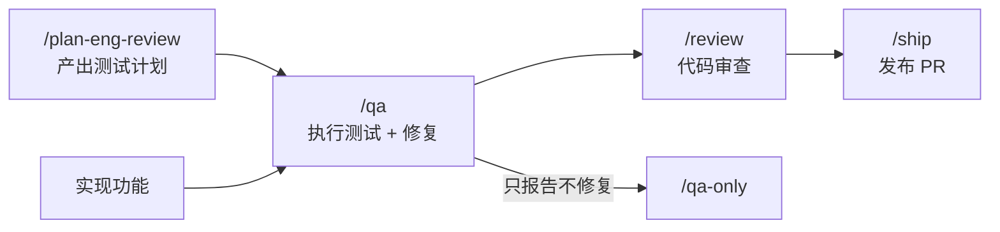

# `/qa`

> **一句话定位：** 系统性 QA 测试 + 修复。像真实用户一样测试 Web 应用，点击每个元素、填写每个表单、检查每个状态。发现 bug 后直接修复源码，每个修复独立提交，重新验证，产出修复前后健康评分和发布就绪摘要。

---

## **概述**

`/qa` 是 gstack 中最完整的质量保障技能，v2.0.0。

它不只是"测试"，而是**测试 + 修复 + 验证**的完整循环。

与 `/qa-only`（只生成报告，不修复）不同，`/qa` 会直接改代码，提交，然后重新测试确认修复有效。

**触发时机：**

- 你说"qa"、"测试这个站点"、"找 bug"、"测试并修复"
- 你说"这个功能准备好测了"或"这个能用吗？"
- 准备发布前的最终质量检查

**三种深度层级：**

| 层级       | 触发           | 修复范围             |
| ---------- | -------------- | -------------------- |
| Quick      | `--quick`      | 只修 critical + high |
| Standard   | 默认           | + medium             |
| Exhaustive | `--exhaustive` | + low/cosmetic       |

---

## **参数解析**

| 参数     | 默认值                   | 覆盖示例                                        |
| -------- | ------------------------ | ----------------------------------------------- |
| 目标 URL | 自动检测或必填           | `https://myapp.com`、`http://localhost:3000`    |
| 层级     | Standard                 | `--quick`、`--exhaustive`                       |
| 模式     | full                     | `--regression .gstack/qa-reports/baseline.json` |
| 输出目录 | `.gstack/qa-reports/`    | `Output to /tmp/qa`                             |
| 范围     | 完整应用（或 diff 范围） | "只测试结账页面"                                |
| 认证     | 无                       | "以 user@example.com 登录"、导入 cookies        |

---

## **前置检查**

### 1. CDP 模式检测

```bash
$B status 2>/dev/null | grep -q "Mode: cdp" && echo "CDP_MODE=true"
```

如果是 CDP 模式（连接到用户真实浏览器），跳过 cookie 导入提示，跳过 user-agent 覆盖，真实认证会话已可用。

### 2. 工作树必须干净

```bash
git status --porcelain
```

如果有未提交改动，**立即停止**，询问：

```
你的工作树有未提交的改动。/qa 需要干净的工作树，
这样每个 bug 修复才能有独立的原子提交。

A) 提交我的改动（推荐）
B) Stash 我的改动
C) 中止
```

---

## **测试计划来源**

在回退到 git diff 启发式分析之前，先检查更丰富的测试计划来源：

1. **项目级测试计划：** 检查 `~/.gstack/projects/$SLUG/` 下最近的 `*-test-plan-*.md` 文件（由 `/plan-eng-review` 生成）
2. **对话上下文：** 检查当前对话中是否有 `/plan-eng-review` 或 `/plan-ceo-review` 产出的测试计划
3. 使用更丰富的来源，只有两者都不可用时才回退到 git diff 分析

---

## **运行模式**

### Diff-aware（自动模式，功能分支 + 无 URL）

这是**最常见的使用场景**。开发者在分支上写了代码，想验证它能用。

自动执行：

**1. 分析分支 diff：**

```bash
git diff main...HEAD --name-only
git log main..HEAD --oneline
```

**2. 从变更文件映射受影响的页面/路由：**

- Controller/路由文件 → 对应 URL 路径
- View/模板/组件文件 → 对应渲染的页面
- Model/Service 文件 → 检查哪些 Controller 引用了它们
- CSS/样式文件 → 哪些页面引入了这些样式
- API 端点 → 直接用 `$B js "await fetch('/api/...')"` 测试

**如果 diff 中无法识别明显的页面/路由：** 不跳过浏览器测试。回退到 Quick 模式，导航到首页，测试前 5 个导航目标，检查控制台错误。后端和基础设施变更会影响应用行为，必须验证应用仍然正常工作。

**3. 检测运行中的应用：**

```bash
$B goto http://localhost:3000 || $B goto http://localhost:4000 || $B goto http://localhost:8080
```

如果没找到本地应用，检查 PR 或环境中的 staging/preview URL。

**4. 测试每个受影响的页面：**

- 导航到页面
- 截图
- 检查控制台错误
- 如果变更涉及交互（表单、按钮、流程），端到端测试交互
- 用 `snapshot -D` 验证变更产生了预期效果

**5. 与提交信息和 PR 描述交叉验证：** 意图是什么？实际上做到了吗？

---

### Full（提供 URL 时的默认模式）

系统性探索，访问每个可达页面，记录 5–10 个有证据的问题，产出健康评分。

### Quick（`--quick`）

30 秒冒烟测试。首页 + 前 5 个导航目标。检查：页面是否加载？控制台错误？断链？

### Regression（`--regression <baseline.json>`）

运行 Full 模式，然后加载上次的基准 JSON，对比：哪些问题已修复？哪些是新问题？评分变化了多少？

---

## **完整工作流程**

---

### **Phase 1：初始化**

1. 找到 browse 二进制
2. 创建输出目录 `.gstack/qa-reports/screenshots/`
3. 从 `qa/templates/qa-report-template.md` 复制报告模板
4. 启动计时器

---

### **Phase 2：认证（如需要）**

```bash
$B goto <URL>
$B snapshot -i          # 找到登录表单
$B fill @e3 "user@example.com"
$B fill @e4 "[REDACTED]"   # 永不在报告中包含真实密码
$B click @e5            # 提交
$B snapshot -D          # 验证登录成功
```

如果提供了 cookie 文件：

```bash
$B cookie-import cookies.json
$B goto <URL>
```

如果遇到 2FA/OTP → 询问用户验证码并等待。

如果遇到 CAPTCHA → 告知用户在浏览器中完成，然后告诉我继续。

---

### **Phase 3：定向**

获取应用地图：

```bash
$B goto <URL>
$B snapshot -i -a -o "$REPORT_DIR/screenshots/initial.png"
$B links       # 映射导航结构
$B console --errors
```

**检测框架（记录到报告元数据）：**

- HTML 中有 `__next` 或 `_next/data` 请求 → Next.js
- `csrf-token` meta 标签 → Rails
- URL 中有 `wp-content` → WordPress
- 无页面刷新的客户端路由 → SPA

**SPA 注意：** `links` 命令可能返回很少结果，因为导航是客户端的。用 `snapshot -i` 找导航元素（按钮、菜单项）代替。

---

### **Phase 4：探索**

系统性地访问页面。每个页面执行：

```bash
$B goto <URL>
$B snapshot -i -a -o "$REPORT_DIR/screenshots/page-name.png"
$B console --errors
```

**每页探索清单：**

1. **视觉扫描** — 查看注释截图中的布局问题
2. **交互元素** — 点击按钮、链接、控件，它们能用吗？
3. **表单** — 填写并提交。测试空值、无效值、边界情况
4. **导航** — 检查所有进出路径
5. **状态** — 空状态、加载中、错误、溢出
6. **控制台** — 交互后有新的 JS 错误吗？
7. **响应式** — 检查移动端视口：

```bash
$B viewport 375x812
$B screenshot "$REPORT_DIR/screenshots/page-mobile.png"
$B viewport 1280x720
```

**深度判断：** 核心功能（首页、Dashboard、结账、搜索）多花时间，次要页面（关于、条款、隐私）少花时间。

---

### **Phase 5：记录**

发现问题时**立即记录**，不要批量处理。

**两种证据层级：**

**交互性 bug（断裂的流程、死按钮、表单失败）：**

```bash
$B screenshot "$REPORT_DIR/screenshots/issue-001-step-1.png"
$B click @e5
$B screenshot "$REPORT_DIR/screenshots/issue-001-result.png"
$B snapshot -D
```

**静态 bug（错别字、布局问题、图片丢失）：**

```bash
$B snapshot -i -a -o "$REPORT_DIR/screenshots/issue-002.png"
```

每个问题立即写入报告，使用模板格式。

---

### **Phase 6：收尾**

1. 计算健康评分（见下方评分体系）
2. 写"最需修复的 3 件事"
3. 写控制台健康摘要
4. 更新严重性计数
5. 填写报告元数据
6. 保存 `baseline.json`

---

## **健康评分体系**

计算各维度评分（0–100），然后加权平均。

**控制台（权重 15%）：**

| 错误数 | 分数 |
| ------ | ---- |
| 0      | 100  |
| 1–3    | 70   |
| 4–10   | 40   |
| 10+    | 10   |

**链接（权重 10%）：** 0 断链 → 100，每个断链 -15。

**每个发现的扣分：**

| 严重性   | 扣分 |
| -------- | ---- |
| Critical | -25  |
| High     | -15  |
| Medium   | -8   |
| Low      | -3   |

**维度权重：**

| 维度   | 权重 |
| ------ | ---- |
| 控制台 | 15%  |
| 链接   | 10%  |
| 视觉   | 10%  |
| 功能   | 20%  |
| UX     | 15%  |
| 性能   | 10%  |
| 内容   | 5%   |
| 无障碍 | 15%  |

---

## **Phase 7：分类**

按严重性排序所有问题，根据层级决定修复范围：

- **Quick：** 只修 critical + high，medium/low 标为"延期"
- **Standard：** 修 critical + high + medium，low 标为"延期"
- **Exhaustive：** 修全部，包括 cosmetic/low

无法从源码修复的（第三方组件 bug、基础设施问题）无论层级都标为"延期"。

---

## **Phase 8：修复循环**

对每个可修复的问题，按严重性顺序：

### 8a. 定位源码

只修改直接导致问题的文件。

### 8b. 修复

最小改动，只解决这个问题。不重构周边代码，不添加功能，不"顺手改进"无关内容。

### 8c. 提交

```bash
git add <文件>
git commit -m "fix(qa): ISSUE-NNN — 简短描述"
```

**每个修复一个提交，永不打包。**

### 8d. 重新测试

```bash
$B goto <URL>
$B screenshot "$REPORT_DIR/screenshots/issue-NNN-after.png"
$B console --errors
$B snapshot -D
```

每个修复都要有**修复前后截图对**。

### 8e. 分类结果

- **verified** — 重测确认有效，无新错误
- **best-effort** — 已修复但无法完全验证（需要认证状态、外部服务）
- **reverted** — 检测到回归 → `git revert HEAD` → 标记为"延期"

---

### **8e.5. 回归测试**

**跳过条件：** 分类不是"verified"，或修复是纯视觉/CSS 无 JS 行为，或没有检测到测试框架且用户拒绝了引导。

**1. 学习项目已有测试模式：** 读取修复附近的 2–3 个测试文件，精确匹配：文件命名、导入、断言风格、describe/it 嵌套、setup/teardown 模式。回归测试必须看起来像同一个开发者写的。

**2. 追踪 bug 代码路径，然后写回归测试：**

- 什么输入/状态触发了 bug？（精确的前置条件）
- 它走了哪条代码路径？
- 在哪里断了？（失败的精确行/条件）
- 哪些其他输入可能走相同路径？（修复周围的边界情况）

测试**必须**：

- 建立触发 bug 的前置条件
- 执行暴露 bug 的操作
- 断言正确行为（不是"它渲染了"或"它没有抛出"）
- 包含完整归因注释：

```javascript
// Regression: ISSUE-NNN — {什么坏了}
// Found by /qa on {YYYY-MM-DD}
// Report: .gstack/qa-reports/qa-report-{domain}-{date}.md
```

**测试类型决策：**

| Bug 类型                                 | 测试类型               |
| ---------------------------------------- | ---------------------- |
| 控制台错误 / JS 异常 / 逻辑 bug          | 单元或集成测试         |
| 表单断裂 / API 失败 / 数据流 bug         | 带请求/响应的集成测试  |
| 有 JS 行为的视觉 bug（下拉框断裂、动画） | 组件测试               |
| 纯 CSS                                   | 跳过（由 QA 重跑捕获） |

**3. 只运行新测试文件：**

```bash
{检测到的测试命令} {新测试文件}
```

**4. 评估：**

- 通过 → 提交：`git commit -m "test(qa): regression test for ISSUE-NNN — {desc}"`
- 失败 → 修一次。还是失败 → 删除测试，延期。
- 探索超过 2 分钟 → 跳过并延期。

---

### **8f. 自我调节（每 5 个修复后评估）**

```
WTF-LIKELIHOOD:
从 0% 开始
每次 revert：+15%
每个修复触碰 > 3 个文件：+5%
第 15 个修复后：每额外修复 +1%
所有剩余低严重性问题：+10%
触碰无关文件：+20%
```

**WTF > 20%：立即停止**，展示已完成内容，询问是否继续。

**硬上限：50 个修复。** 超过后无论剩余多少，停止。

---

## **Phase 9：最终 QA**

所有修复应用后，对所有受影响页面重新运行 QA，计算最终健康评分。

**如果最终评分比基准更差：显著警告** — 某些东西回归了。

---

## **Phase 10：报告**

**本地：** `.gstack/qa-reports/qa-report-{domain}-{YYYY-MM-DD}.md`

**项目级：** `~/.gstack/projects/{slug}/{user}-{branch}-test-outcome-{datetime}.md`

每条问题额外包含：

- 修复状态：verified / best-effort / reverted / deferred
- 提交 SHA（如已修复）
- 改动的文件（如已修复）
- 修复前后截图

PR 一行摘要：

> "QA 发现 N 个问题，修复了 M 个，健康评分 X → Y。"

---

## **Phase 11：更新 TODOS.md**

如果 repo 有 `TODOS.md`：

- 新的延期 bug → 添加为 TODO，附严重性、分类和复现步骤
- 已修复的 bug 如果之前在 TODOS.md 中 → 注明"由 /qa 修复于 {branch}，{date}"

---

## **框架特定指南**

**Next.js：** 检查 hydration 错误，监控 `_next/data` 请求的 404，测试客户端导航（点击链接，不只是 `goto`），检查 CLS。

**Rails：** 检查 N+1 查询警告，验证 CSRF token，测试 Turbo/Stimulus 集成，检查 flash 消息。

**WordPress：** 检查插件冲突（不同插件的 JS 错误），验证已登录用户的管理员栏，测试 REST API 端点，检查混合内容警告。

**通用 SPA（React/Vue/Angular）：** 用 `snapshot -i` 导航（`links` 命令会漏掉客户端路由），测试浏览器前进/后退，检查内存泄漏。

---

## **核心规则**

1. **复现是一切。** 每个问题至少一张截图，没有例外。
2. **记录前先验证。** 重试一次确认可复现，不是偶发。
3. **永不包含凭据。** 密码写 `[REDACTED]`。
4. **增量写入。** 发现问题就立即追加到报告，不要批量处理。
5. **不读源码。** 像用户一样测试，不是开发者。
6. **每次交互后检查控制台。** 不在视觉上显现的 JS 错误仍然是 bug。
7. **像用户一样测试。** 使用真实数据，端到端走完完整流程。
8. **深度优于广度。** 5–10 个有证据的问题 > 20 个模糊描述。
9. **永不拒绝使用浏览器。** 即使 diff 看起来没有 UI 变更，后端变更会影响应用行为，始终打开浏览器测试。

---

## **与其他技能的关系**



---

## **一句话总结**

`/qa` 不是"测试报告生成器"。

它是一个会修 bug 的 QA 工程师。

测到、修到、验证到，然后告诉你：可以发了。

## 源码目录

gstack 仓库内技能实现目录：[`qa/`](https://github.com/garrytan/gstack/tree/main/qa)
