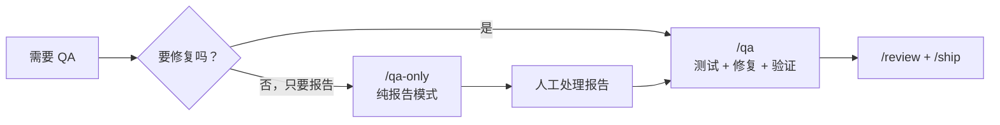

# `/qa-only`

> **一句话定位：** 纯报告模式的 QA 测试。系统性测试 Web 应用，产出带健康评分、截图和复现步骤的结构化报告——但永远不修复任何东西。需要完整的测试-修复-验证循环，请用 `/qa`。

---

## **概述**

`/qa-only` 是 `/qa` 的只读版本。

两者的测试流程完全相同：打开浏览器、点击每个元素、填写每个表单、检查每个状态、截图记录。区别只有一条：

**`/qa-only` 永远不碰源码，永远不提交，永远不修复。**

**触发时机：**

- 你说"只报告 bug"、"qa 报告"、"测试但不修复"
- 你需要一份给团队或客户的 bug 报告
- 你想先看清楚问题全貌，再决定由谁来修
- 在不允许 AI 直接改代码的环境中做 QA

---

## **与 `/qa` 的关键区别**

| 维度       | `/qa`                | `/qa-only`               |
| ---------- | -------------------- | ------------------------ |
| 测试流程   | 完整（Phase 1–11）   | 完整（Phase 1–6）        |
| 修复 bug   | ✅ 直接修复 + 提交   | ❌ 永不修复              |
| 回归测试   | ✅ 自动生成          | ❌ 不生成                |
| 工作树要求 | 必须干净             | 无要求                   |
| 适用场景   | 独立开发者，想直接修 | 团队协作，报告给人工处理 |

---

## **参数解析**

| 参数     | 默认值                   | 覆盖示例                                     |
| -------- | ------------------------ | -------------------------------------------- |
| 目标 URL | 自动检测或必填           | `https://myapp.com`、`http://localhost:3000` |
| 模式     | full                     | `--quick`、`--regression <baseline.json>`    |
| 输出目录 | `.gstack/qa-reports/`    | `Output to /tmp/qa`                          |
| 范围     | 完整应用（或 diff 范围） | "只测试结账页面"                             |
| 认证     | 无                       | "以 user@example.com 登录"、导入 cookies     |

注意：`/qa-only` 没有 `--exhaustive` 层级参数，因为它不修复，严重性分级只影响报告的排序优先级。

---

## **测试计划来源**

与 `/qa` 相同，在回退到 git diff 分析之前，先检查：

1. `~/.gstack/projects/$SLUG/` 下最近的 `*-test-plan-*.md` 文件（由 `/plan-eng-review` 生成）
2. 当前对话中是否有 `/plan-eng-review` 或 `/plan-ceo-review` 产出的测试计划

使用更丰富的来源，两者都没有时才回退到 git diff 分析。

---

## **运行模式**

与 `/qa` 完全相同：

**Diff-aware（功能分支 + 无 URL 时自动触发）** — 分析分支 diff，映射受影响页面，只测试变更相关的路由。这是最常见的使用场景。

**Full（提供 URL 时的默认）** — 系统性访问每个可达页面，记录 5–10 个有证据的问题，产出健康评分。

**Quick（`--quick`）** — 30 秒冒烟测试，首页 + 前 5 个导航目标。

**Regression（`--regression <baseline.json>`）** — 与上次基准对比，输出新增/已修复问题和评分变化。

---

## **完整工作流程**

测试流程（Phase 1–6）与 `/qa` 完全一致：

### **Phase 1：初始化**

创建输出目录，从模板复制报告，启动计时器。

### **Phase 2：认证（如需要）**

```bash
$B goto <URL>
$B snapshot -i
$B fill @e3 "user@example.com"
$B fill @e4 "[REDACTED]"  # 永不在报告中包含真实密码
$B click @e5
$B snapshot -D
```

支持 cookie 文件导入、2FA 等待、CAPTCHA 人工处理。

### **Phase 3：定向**

```bash
$B goto <URL>
$B snapshot -i -a -o "$REPORT_DIR/screenshots/initial.png"
$B links
$B console --errors
```

检测框架（Next.js / Rails / WordPress / SPA），记录到报告元数据。

### **Phase 4：探索**

每个页面执行：

```bash
$B goto <URL>
$B snapshot -i -a -o "$REPORT_DIR/screenshots/page-name.png"
$B console --errors
```

**每页探索清单：** 视觉扫描 → 交互元素 → 表单测试 → 导航路径 → 各种状态 → 控制台 → 响应式检查。

核心功能多花时间，次要页面少花时间。

### **Phase 5：记录**

发现问题立即记录，不批量处理。

**交互性 bug（截图前 + 执行操作 + 截图后 + snapshot -D）：**

```bash
$B screenshot "$REPORT_DIR/screenshots/issue-001-step-1.png"
$B click @e5
$B screenshot "$REPORT_DIR/screenshots/issue-001-result.png"
$B snapshot -D
```

**静态 bug（单张注释截图）：**

```bash
$B snapshot -i -a -o "$REPORT_DIR/screenshots/issue-002.png"
```

### **Phase 6：收尾**

计算健康评分，写"最需修复的 3 件事"，汇总控制台错误，保存 `baseline.json`。

---

## **健康评分体系**

与 `/qa` 完全相同：

| 维度   | 权重 |
| ------ | ---- |
| 控制台 | 15%  |
| 链接   | 10%  |
| 视觉   | 10%  |
| 功能   | 20%  |
| UX     | 15%  |
| 性能   | 10%  |
| 内容   | 5%   |
| 无障碍 | 15%  |

每个 Critical 发现 -25 分，High -15，Medium -8，Low -3。最低 0 分。

---

## **输出**

**本地：** `.gstack/qa-reports/qa-report-{domain}-{YYYY-MM-DD}.md`

**项目级：** `~/.gstack/projects/{slug}/{user}-{branch}-test-outcome-{datetime}.md`

```
.gstack/qa-reports/
├── qa-report-{domain}-{YYYY-MM-DD}.md
├── screenshots/
│   ├── initial.png
│   ├── issue-001-step-1.png
│   ├── issue-001-result.png
│   └── ...
└── baseline.json
```

**注意：** `/qa-only` 的报告里**没有** "Fix Status"、"Commit SHA"、"Files Changed"、"Before/After screenshots" 这些字段，因为它不修复任何东西。

---

## **核心规则**

1. **复现是一切。** 每个问题至少一张截图，没有例外。
2. **记录前先验证。** 重试一次确认可复现。
3. **永不包含凭据。** 密码写 `[REDACTED]`。
4. **增量写入。** 发现问题就立即追加，不批量处理。
5. **不读源码。** 像用户一样测试。
6. **每次交互后检查控制台。** 不可见的 JS 错误仍然是 bug。
7. **像用户一样测试。** 真实数据，完整流程。
8. **深度优于广度。** 5–10 个有证据的问题 > 20 个模糊描述。
9. **永不删除输出文件。** 截图和报告累积是有意为之。
10. **永不拒绝使用浏览器。** 即使 diff 看起来没有 UI 变更，后端变更也会影响应用行为。

### `/qa-only` 专属规则

**第 11 条（最重要）：永不修复 bug。** 只发现和记录。不读源码，不编辑文件，不在报告里建议修复方案。你的工作是报告什么坏了，不是修它。需要修复，用 `/qa`。

**第 12 条：** 如果项目没有测试框架，在报告摘要中注明：

> "未检测到测试框架。运行 `/qa` 可自动引导建立测试框架并启用回归测试生成。"

---

## **与其他技能的关系**



---

## **一句话总结**

`/qa-only` 是一个只有眼睛没有手的 QA 工程师。

看得见所有问题，写得清所有证据，但不动一行代码。

## 源码目录

gstack 仓库内技能实现目录：[`qa-only/`](https://github.com/garrytan/gstack/tree/main/qa-only)
